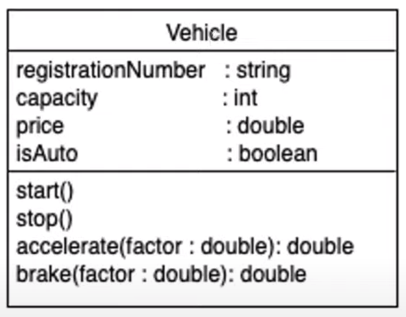
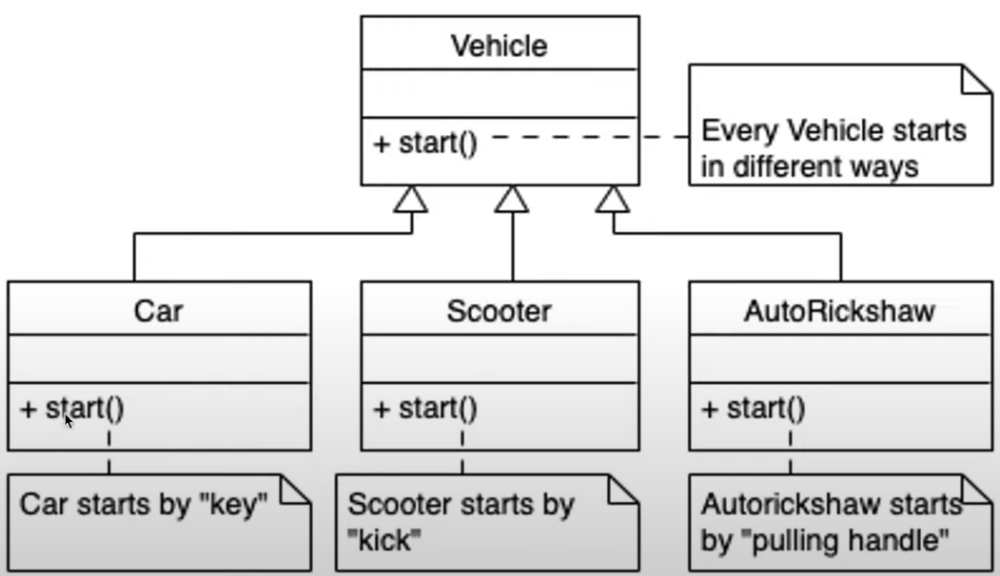

# Object Oriented Programming Concepts in Corporate World

## Contents
 - [Introduction](#introduction-to-object-oriented-world)
 - [Iterative Development Life Cycle](#iterative-development-life-cycle)
 - [Relationships](#relationships)
 - [Mechanisms](#mechanisms)

# Introduction to Object Oriented World
- Everything around us is an object
- Dog barks, Cat meows, Hyena lauhgs?
- What's the value addition?
- We perceive surrounding things as objects
- In real world Object is a combination of _living_ and _non-living_ things.
- OO software world conceptual objects
- In the software virtual world, every object is an autonomous agent.
- **Autonomous Agents** 
    - Example: Suposse the operator presses the button of the radar, radar will starts its _own work_ now. So, radar will start rotating its surveillance antenna and it will keep on detecting, once the target is detected, it will give message to it's tracking antenna, now operator is no more in the picture. Now, Radar is taking by its own few actions such as send message to the tracking antenna, it is also going to send a message to the gun, and a message on the screen of the operator, i.e., i've detected something.

        In this sense, the radar as an object, if we treat it as an autonomous agent, the radar will have its own functionalities based on the logic to be triggered. It'll also have its own data and objects inside it, so it can use those data or internal objects. Whereas whatever goes out of the scope of the object it will send a message to the other object.
- Objects collaborate with each other to perform higher level tasks

## Complexity of Systems
We are talking abut the applications or the systems which are of larger size or larger scope such as railway ticket booking service, airline ticket booking service etc.

All these system being complex in nature, there are certain properties associated with the system, and those are as follows:
- Complex Systems are more vulnerable to break down whereas a simple system is easy to break down.
- We are talking about systems which might be using very large amount of data
    - Whenever you call to a helpline no, you get a message that, _this call is being recorded for analytical purpose_.
    - There is going to some repo, where all this data is being stored and such huge volumne of data will be analyzed by some other system.
- Systems itself might contains some Intelligent decisions.
    - Intelligent decisions are based on the volumne of data and those are not outcome of some if-else statement
    - Their might be some statistical elements involved in it, and that is where system is related to the intelligent systems.
- If we look at the challenges, then we can easily convince that efforts required for developing such application exceeds individual intellect and capabilities.
- Since, we are not going to be depended on a single person that is why it requires a collaborative and coordinated efforts in order to develop such kind of systems.
- **How do we collaborate?**
    - To handle this, the best solution is to split the functionalities (the total) into meaningful parts; is the common solution which has worked for many developers. *(Divide and Rule)*
- First divide the functionalities into meaningful parts and then rule the complete system.

Splitting the system into smaller parts in the world of software is known as **Decomposition**.

**Decomposition** means consider a complete system break it into smaller modules/classes/functionalities/ procedures/files, etc.

There are two dominant ways of decomposition used in software field:
- Object Oriented Decomposition **(Imp)**
- Algorithmic or Arithmetic Decomposition

### Object Oriented Decomposition
- In this method of decomposition or splitting the toal into meaningful parts what we do is, **we distribure the functionalities called autonomoues agents as objects**
    - **Autonomous Agent** is an object that can act independently and without human intervention. It has its own goals, beliefs, and capabilities, and it can make decisions about how to achieve its goals based on its environment. Autonomous agents can communicate with each other and with the outside world, and they can learn and adapt over time.
    - This individual objects are going to own their own set of data required for performing the task, which they have been allocated.
    - It is always suggested that the responsibilities and power should go hand in hand.
- Object own operation set and data required to run it.
- Objects need not do everything of their own but objects can send message to each other and get the work done, otherwise their will be no presence of decomposition.
- Object Oriented Decomposition gives us the individual units as objects as capsules, they do have their own data, they do have their own tasks to be performed on them.
- Now, in order to send messages to each other, the objects do need some reference to pass message.
    - Object A want to send message B, in order to send the message, the object A must have reference of the Object B for doing certain tasks.
- After decompostion what we get is:
    - the set of objects
    - each object with its own data
    - with its own responsibilities or the functionalities called on that object
    - and, the relationship between those objects, which must exist for objects to call upon each other functionalities.

### Algorithmic or Arithmetic Decomposition
- In this method of decomposition, whenever we decompose a complete functionality of the application or a set of expected functionalities from that application as a blackbox, **we split them into functional units**.
    - The functionalities are split such as procedures, functions or routines, and we attach a sequence for them
        - We attach a functionality saying such as functionality A will be executed, inside it functionalities B,C, D might be executed and so on.
- This decomposition was more infavour of procedural languages.
- In Algorithmic Decomposition we consider the functional steps in overall process
- The sequence is also embedded inside it: What + Which sequence
- This way of decomposition used to give us a picture **what is happening** and in **which sequence it's happening**
- This is the way how the algorithmic decomposition works.

**If the same system was decomposed using the Object Oriented Decomposition, then how we could do it?**
- Objects are treated as autonmous agents
- Collaboration through messages

    

-------------------------

# Iterative Development Life Cycle
## SDLC Waterfall Model

## IDLC (Iterative Development Life Cycle)
- This lifecycle depends on iterations.
- Once we iterate over the complete set of requirements, we can split them into different sizes or packets 
- One packet at a time will be taken for different iterations
- Response to dynamic nature of requirements
- Collaborative development
- Core + Incremental feature addition
- Core set requirements in the first iteration
- Mutiple waterfalls inside one another
- Every 2-3 months we'll be keep adding features
 

## Object Oriented Development
- It is based on real abstractions (Real World + Programmatic)
- In OOD we found that, we are going to identify the objects or classes and we call them as **Abstraction**
- Their will be two types of **Abstraction**:
    1. Coming out from requirements statement OR from real world OR domain vocabulary
    2. Programmatic world from the designs or the implementation steps
- Life cycle is iterative + incremental in nature
- Main focus: Identify and organize the abstractions, relationships
- Clean design in precise notation (UML)
- UML is specifically designed for documenting the model and defining its specification.
- Precise documentation (UML Models)

## Advantages of Software Modelling
- Reduced focus on implementation language ; language independent
- Detect expensive deisgn flaws at early stage
- Way of thinking and not programming
- Communication medium for abstract concepts
- Easy communication with stakeholders
- Artifacts for documentation, specificaiton, interfacing
- Seamless uniform (UML) notation
- Lossless transitions

## Object Oriented Development Stages
- System Conception
- Requirements Analysis
- Analysis Modelling
    - Domain Model (Real World Objects)
    - Application Model (Application Concepts)
- System Design
- Class Design
- Implementation
- Validation at all stages

### System Conception
- Whenever a new product is thought of that time the first concept of that application is discussed for the business perspectives, and that is where **Business Analysts and Architects, including domain experts** will be part of it. They key decision makers, are involved in this stage.
- Developers and Testers are not involved in this stage.
- People involved in this stage **discusses about business impacts, any architectural suggestions** or any **domain expert advice**, because that gives the feasibility of the system.
- Main **focus** is on **business value addition**, rather than how the system will be developed.
- What is expected is discussed more, rather than how the system will be developed.
- At the end, **we get a set of tentative requirements**
- This set of tentative requirements talks about what the system overall should be doing about it, and it gives a clear idea about the clearer picture which is in the mind and it's business values.
- Therefore, system conception stage genereates the set of tentative requirements which are not complete in nature but becomes the input for the next stage, called as *Requirement Analysis*.

### Requirement Analysis
- **Domain experts, solution architects, System analysts** are part of this team of this stage.
- This stage is mainly going to focus on strunity and restating requirements
    - Because at the first stage, people have not given attention in detailing the requirements, but the idea was to just come up with set of tentative requirements.
- People involved in this stage, they will take each requirement in a set, discuss with their peers, and come up with what are all the things which needs to be added in the document to make requirement crystal clear.
- Every requirement needs to be clear, their cannot be any contradiction in the requirements, **requriements needs to be consistent.**
- Developers and Testers are not involved in this stage.
- Whenever their some detects are found in set of tentative requirements or any queries are genereated based on it, those are resolved during *query resolution meetings*.
- This set of requirmenets is going to give a clear picture of what is expected. 👉 Clear Set of Requirements
- At this stage people might be developing domain application models 
- Domain and application models are the models based on classes decomposed from the domain itself, basically the vocabulary of the domain.
- Domain Model is the input to the application model, and both these models are exercies at the stage of requirement analysis.

### Essential Characteristics of Model
- Models should be as simple as possible
    - Because, it's going to be common medium of communication with the coders.
    - If the model is complex, the stakeholders will not be able to communicate with each other.
- Models should be unambigous and should **avoid inessential details**.
- UML Notation provides enough clarity and precies notation to make it unambigous.
- Model should be language independent.
- Model should be platorm independent till certain stages, at design stage it might have influence of platform to some extent.
- The idea of model is the potential stake holders need to understand the model, in the intial stages (requirment analysis).

### System Design
- This is the stage where we take overall decision of the project.
- In this stage, overall **architecture is discussed**. that is why, the **technical leaders, architects are involved.**
- In this stage, maybe the business analysis or the domain experts are not that important.
    - because in this stage, we talk about the technical features of the system.
- Architecture should be whether monolithic, distributed, sevice-based or microservices; what kind of are architecture we are thinking of? 
    - This decision is non-reversible in iterations.
- It is also called as the top level design, architecture.
- In this stage, the performance characteristics, is also discussed.
    - how many users will be using it?
    - how many simulatenous users will be using it?
    - what should be the criteria?
- Communication Protocols (Real-time based / Queue-based?)
- Architectural Patterns (MVC?)
- System Design happens on the overall system.

### Class Design
- Detailing application model
- System design as a guide line
- Mostly the focus on this stage is Data Structures and Algorithms (like comparisons, sorting, etc...).
- Fixing Violations (e.g. broken encapsulaton)
- This stage is part of the advanced part of Object Oriented Analysis and Design.
- Proxy object : authorization, indirection layers : who did what
- Design Patterns
- Can get influenced by implementation platform

## Implementation
- Design model translated to
    - Implemented language (logic)
    - Database (stored procedure)
    - Hardware (sensors)
- At this stage, all the software related practices are applicable.
- Good class design makes it simple translation
- Software engineering practices
- Traceability req -> design -> impl

## UML Models - Introduction
There are three types of UML Models:
- Class Model
- State Model
- Interaction Model

All these three models are separate, but they provide input to each other/they depend on each other.

## Class Model
- **Class** Model's nature is itself of a **static structure of classes and objects**
    - Static structure means their is no reference to the time/sequence it only **talks about** who are the **autonomous agents** and what is the **relationship** between them.
- It provides complete context for software development
- The Class Model identifies Class details (coming from Object Oriented Decomposition) and relationships
- Class Model can be realized using
    - Class diagram
    - Obujct Diagram

    

## State Model
- Aspects of object which changes over time
- Realized by state chart diagram
- States and state transitions

    

## Interaction Model
- Interactions model captures the interaction between outside-world and system
- Interaction between objects
- There are three diagrams in Interaction Model
    - **Use Case Diagram** : These are the diagrams which are drawn to capture the functionality
    - **Sequence Diagram**
    - **Activity Diagram** :
        - It captures the overall process and workflows.
        - It is useful in the beginning stage such as requiremement analysis

## Use Case Diagram
- Interactions between outside-world and system
- It consists of Actors and Use Cases
- Supported by descriptive scenarios

    

## Sequence Diagram
- Interaction between actors, object
- Provides time sequence

    

### Overall Development Process
- Analysis to implementation in iterations
- Same notation at different levels
- Object Oriented Concepts throughout
- Validate model at every stage

-----------------------------------------

# Relationships

## Class Representation
- A class is a specification/template
- A class represented as rectangle with three partitions.
    - topmost portion
    - middle portion
    - bottom portion
    
    
    *Topmost participation* contains the **name of the class**.
    
    
    - The *middle partition/portion* of the class is used to specify **how the data of the object should be enetered.**
        - The set of entries in the middle portion of the class is known as **Attributes.**
        - Every attribute of a class is given a *key-value pair*.
        - A **Key** is name of that attribute and **Value** is the data type of that attribute.
        - Always use primitive data types to express attributes.
        - Example:
        
    - The third (bottom) partition/portion of the class is the place to write the **operations/activities** to be performed. 
    - The bottom portion of the class basically **signifies the signature of operation** which can be called on this Vehicle *(say classname)*.  
    

## Object Representation
- A class has potential to create muliple instances of object, from a single class description.
- An object is represented as underlined text and the object name is written before the colon, as shown below
- Here, key is the name of the attribute which is same as the class, but the **value of the key** in the object representation is **actual value** which is specific to the particular instance of that object.
- This represents an object. 👇  

- We can also keep an object without specifying any name, this type of object is known as **Anonymous Object**. *(Third Example shown in the diagram above)*

- In class description there are three partitions but, **in object representation there are only two partitions**. Third partition is not necessary.

## Data Types
From the example given below, a Vehicle has attributes such as **registrationNumber, capacity, price, isAuto** and Vehicle also has **Engine**.

If Vehicle has got Engine, Engine also has few attributes of its own, if we try to add all the attributes of the Engine in the Vehicle then we are not doing justice with the object oriented concepts. 

This is because, Vehicle does not have power or cylinder but it has only Engine and Engine has got all this properties.

As decomposition says, we should distribute the available information across all the objects in a justifiable manner.
- To represent a such type of **composite data type**, we use something called as a relationship.
    - As we can see from the diagram, the Vehicle and Engine Class data types are related to each other.
    - Enginge is completed related to the type of the vehicle
- Similary colour is a data type, as in this example, only three colours are mentioned nothing beyond that, in this case we call such data as **Enumerated Data**.
- **Enumeration** can also be represented in UML like any other class, that is why we use word type instead of a class, bcoz type is a more generic name given to this representaiton.
- In general, enumerated data types does not have any behaviour, their operations are fixed and that is why enumeration can be shown with the possible values.

## Composite Type Relationship
- 
- Enumeration is different from class, it does not have key-value pairs
- Example of Composite type relationship
- 
- 
- If their is a relationship at the class level, then their can also be a relationship at the object level.

## Relationship - Association
- Association as a relationship can exist between two classes where the classes do have existence or the objects of the classes.
- Instances of these classes are existing **independent of each other but together independent objects collaborate for higher level behaviour** with the help of association.
- Instances of the said class is independently existing to other class
- Valid muliplicity examples 3/0..2/2,3,5..8/5..*/ {ONLY EVEN}
- Invalid values: -ve functions
- Straight line represents an association
- The solid triangle is the reading direction whereas the name before than symbol denotes association name.  
-   
- 

    - A Person can drive either no car or 1 car atmost (0..1).
    - A Car can be driven by either nobody or atmost 1 person (0..1)
    - (*) represents many or any number.
    - Looking from the Person's perspective, Car is a *transport*
    - Looking from the Car's perspective, a Person is a *driver*
    - Similarly, looking from the person's perspective, Company is an employer
    - And looking from the Company's perspective, a Person is an employee.
    - *driver, transport, employee and employer* are the association end names; it is a role which object is playing in context with the another object.
- Every multiplicity values must come from requirements analysis or decomposition.
    - and for these we should have a proof
    - if the requirements are incomplete we raise the query either to domain experts, system analyst or the customer side architects

## Relationship - Aggregation
- *SportsTeam* and *SocialCircle* are **whole** whereas *Student* are **part** of relationship
- Independent objets in **whole-part relationship**

- One *SportsTeam* can have 1..15 players (*Student*), whereas a Student can **play for** of 0..3 *SportsTeam*

- Similarly, A *SocialCircle* can have any number of volunteer as (*Students*) whereas a Student can **contribute to** any number of *SocialCircle*

- Objects of the above class diagrams 👇

- The relationship in an object has a simple link, a simple straight line.
- Link means, for example object *Student* can **collaborate** with object *SocialCircle* with **each other**
- By drawing a specific cases of object we can always use this as a test data for validating our model.

## Relationship - Composition
- Whenever their is a linking of two objects or the container, and the object is the **integral part** of the another object, then, we say this relationship is in **Composition**
- This is a container-contained relationship, but the contained item is completely meaningful only in context with the whole.
- If **BillOfItems** is not their then **ItemDetails** doesn't exist.
- If the **BillOfItems** gets deleted, them the **ItemDetails** will also be deleted.
- Deleting container forces contained objects to get deleted
- Composition is realted to lifetime and is more solid than Aggregation.
- Represented as filled diamond at the container side.
- "**Contained**" doesn't existence outside "**Container**"
  
    

## Relationship - Inheritance
- **Car** *IS A type* of **Fourwheeler**
- **Truck** *IS A type* of **Fourwheeler**
- **Fourwheeler** *IS A type* of **Vehicle**
- **Twowheeler** has an **Handle** as an *integral part* (**Composition**)
    - because if **Twowheeler** is not their **Handle** doesn't carry any meaning.
- It is a mapping *IS-A* relationship
- Always a Derived classes inherit Base class features
- Represented as an arrow with hollow triangle, and hollow traingle is always pointing towards the Base Class side.
- This is an example of Code Reuse (*Inheritance Relationship*)
    
    - Engine is an *integral part* of Vehicle (**Composition**), Fourwheeler *IS A* Vehicle, Twowheel *IS A* vehcile. Therefore, Engine is also an *integral part* of Fourwheeler
        - because Vehicle is the Base/Parent/Super Class and Fourwheeler is the Derived/Child/Sub Class

    - Every class has its **features** (*attributes and operations*) which are of two types:
        - few are of its own, *proprietory* features
        - and few it has *acquired* from its base classes
- Inheritance is Generalization-Specialization Relationship
    - As we **GO UP** --> Generalization 
    - As we **GO DOWN** --> Specializaiton

## Relationship - Multiple Inheritance
- A class can have multiple inheritance
- **WoodenDoor** *IS-A* **Wood**
- **WoodenDoor** *IS-A* **Door**
- Properties/Features of both **Wood** and **Door** are acquired by **WoodenDoor**
- Generalization-Specialization Relationship
- IS-A relationship with more parents
    

## Packaging
- To handle large number of classes, *divide and rule*
- Grouping classes together is known as **packaging**
- Set of classes which are more likely to work together should be put in the same package.
    - Example, In Libaray a book is which related to each other or it is of same genre, it is put in the same cupboard/section.
- Splitting classes separate into different compartments so that we find classes more working together are kept into one compartment.
- Classes those collaborate more with each other will be in same package, otherwise it'll be in other package.
- Packages helps us in isolating the group of classes which can be helped in development independenly.
- Packages allows us to split them into modules or subsystems and such a independent subsystem can be given to independent development team, and at the end we can integrate them.

## Visibility
- Features (*attributes and properties*) visible at different level
- **Private** Attribute/Operation is represented as `-`
    - This visibility means the operation or that attribute is only visible to the core of that class **(Base Class)**
- If any attribute or operation doesn't show any specific symbol of visibility in UML diagram. It means it is a default attribute
    - Default level attributes are package level operations, it is visible in the same class, as well as in the other classes of the same package.
- **Protected** Attribute/Operation is represented as `#`
    - It is accessible inside the class and any class which is the child class of that class
    - Example: **protectedAttribute** and **protectedOperation** is visible to the **Base** Class and its Derived Class: **FuelPowered**
- **Public** Attribute/Operation is represented as `+`
    - It is accesible in inside that class, accessible in the class of the same package, accessible in any child class, infact accessible/visible in any class of that application.
- **Public** has the most *wide visibiliy* and **Private** has the most *restricted visibility*.
- These visibilites plays an important role in design and implementation stage.
    

---------------------------------------

# Mechanisms

## Class Representation in UML
- `Class` - Printer; Three Partitions
- `Object` - floorOnePrint: Printer; underlined, Two Partitions
- `Anonymous Object` - Printer; underlinded, Two Partitions
    

## Objects/Class Data
- In the Object Diagram, there are certain attributes whose values are changing where ther are certain attributes whose values are not changing.
- Observation: There are certain data which are *object specific* whereas there are certain data which are *constant*

- The red rectanglse shows the content which is being repeated in every instance of the object.
- The blue rectangle shows the content which is different in every instance of the object.
- Data represented within a blue rectangle is specific to that particular object
- Data represented within a red rectangle is constant with the Class
- Data need not be replicated unenecessary hence, doing the required changes.
- To *avoid* the *relication* of data, **Static** comes into the picture

- Static Data and Operations:
    
    - Now, we represent the data by underline which will be used by every object.
- Data which is available for every instance of object is called **Instance Data**.
- Data which is not available for every instance of object is called **Static Data**.
    - Static Data is underlined and it is not represented at the object level.
- *username* and *dbPassword* is going to be different for every object
- whereas database, port (static data) and connect (static operation) is going to be same for every object.
- Whenever we call a static method, we cannot use instance data.
- Any static operation can access only static data.

## Dependent and Independent Attributes
- "Essential" Attributes
- "Good to Have" Attributes
- Derived attributes are represented with a preceeding "/"
    

## Code Duplication
- **Common** *(Shown in Red Color)* / **Proprietary** *(Shown in Blue Color)* Attributes
- **Common** *(Shown in Red Color)* / **Proprietary** *(Shown in Blue Color)* Operations
    

## Code Reuse
- *Segregage* that which is **Common** *(Shown in Red Color)*
- *Separate* that which is **Different** *(Shown in Blue Color)*
    

## Operation Overloading
- **S**ame **M**ethod **N**ame **D**ifferent **S**ignatures
- Signature -> Operation_Name + Parameter_Types
- add_int_int
- add_double_double
- add_Fraction_Fraction
- add_Complex_Complex
- also known as Static/Compile-Time Polymorphhism
    
- Another variant of Calculator Class
    - return type is never considered as the part of operation signature
    
    - Since, first method and third method are exectly same, Operation Overloading will not take place.
        - We cannot have exactly same operation with same name and same signature
- Another example:
    - add_double_double_double
    - method name is same, but parameter signature are different
    - Operation Overloading can be done in the same class, not from the different class
    - *Faded text* shows operation/method inherited from the base class
    - As the methods are different in PrecisionControlledCalculator, it is Operator Overloading
    

## Operation Overriding
- **S**ame **M**ethod **N**ame, **S**ame **S**ignature in Parent and Child Class
- Signature -> Operation_Name + Parameter_Types
- Child class function or inherited? --> child class fn preferred
- Overruling/Rewriting/Overwriting
- Operation Overriding helps in achieveing Runtime/Dynamic Polymorphism
- Language Specific Implementation
    
    - Car Class has its own method start() and the other start() method *(shown in gray color)* is inherited from the Vehicle Class.
    - Local method/operation is preffered over the inherited method/operation
    - The operation which is inherited *(gray in color)* will not be used
    - Since the local method/operation is preffered, overriding of the actual method takes place, hence Operation Overriding

## Polymorphism
- Same Operation Multiple Implementations
- New Implementations Possible

