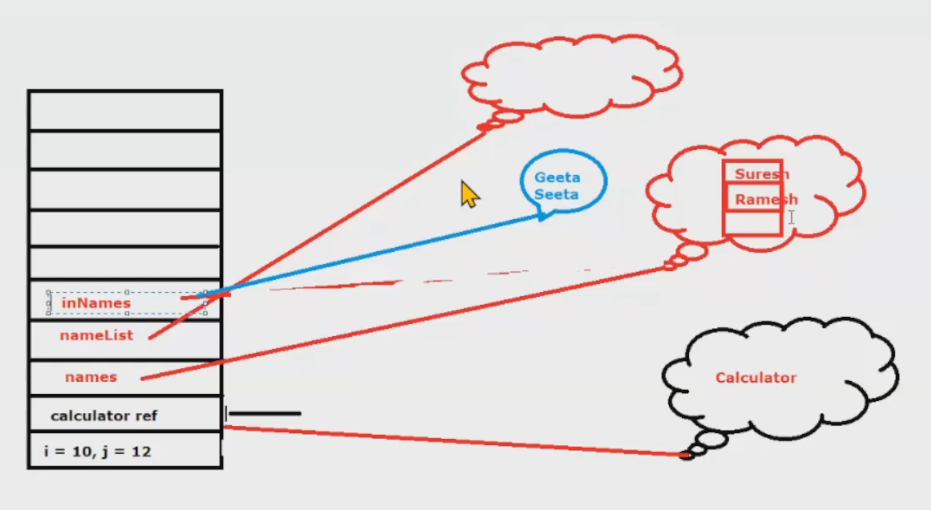

# Session-5 | Exception Handling

- We should never do `System.exit(0)` 👉 leads to abnormal termination of code.
- Example of an ArithmeticException Program
	```java
	public class Exception_01 {
		for(int i = 5; i >= 0; i--) {
			System.out.println("Reciprocal of " + i + " is " + 1/i);
		}
	}
	```
- **Output:**
	```
	Recpirocal of 5 is 0
	Reciprocal of 4 is 0
	Recpirocal of 3 is 0
	Recpirocal of 2 is 0
	Reciprocal of 1 is 0
	Exception in thread "main" java.lang.ArithmeticExpression: /by zero at...
	```
- We handle the exceptions using the `try` and `catch` block
- `Class.forName()` loads the class into the memory and throws `ClassNotFoundException`
- if `Class.forName("java.lang.Strong")` it will show two output, as we have written wrong input.
    - "String class not present" 
    - "String class loaded"
- **Code:**
	```java
	public class Exception_01 {
		public static void main(String[] args) {
			try { // if 👇 throws exception
				Class.forName("java.lang.Strong");
			} catch (ClassNotFoundException e) { //then, it will be caught by 👈 catch block
				System.out.println("String class not present");
			}
			System.out.println("String class loaded");
		}
	}
	```
- **Output:**
	```
	String class not present
	String class loaded
	```
- if `Class.forName("java.lang.String")` it will show one output, as we have written correct input.
    - "String class loaded"
- **Code:**
	```java
	public class Exception_01 {
		public static void main(String[] args) {
			try { // if 👇 throws exception
				Class.forName("java.lang.String");
			} catch (ClassNotFoundException e) { //then, it will be caught by 👈 catch block
				System.out.println("String class not present");
			}
			System.out.println("String class loaded");
		}
	}
	```
- **Output:**
	```
	String class loaded
	```
- When we say `try`, it tries the block of statements if everything goes fine, then the check block is not used, but if Java throws an exception then this `catch` block is used.
- `e.printStackTrace()` is a stack trace, it shows where the error has exactly occurred
	- it is basically a stack image
	- it allows us to help us to debug the program, which might have gone wrong
- **Code:**
	```java
	public class Exception_01 {
		public static void main(String[] args) {
			try { // if 👇 throws exception
				Class.forName("java.lang.Strong");
			} catch (ClassNotFoundException e) { //then, it will be caught by 👈 catch block
				e.printStackTrace();
			}
			System.out.println("String class loaded");
		}
	}
	```
- **Output:**
	```
	java.lang.ClassNotFoundException: java.lang.Strong
		at java.net.URLClassLoader.findClass(Unkown Source)
		at java.lang.ClassLoader.loadClass(Unkown Source)
		at sun.misc.Launcher$AppClassLoader.loadClass(Unkown Source)
		at java.lang.ClassLoader.loadClass(Unkown Source)
		at java.lang.Class.forName0(Native Method)
		at java.lang.Class.forName(Unkown Source)
		at com.persistent...
	String class loaded
	```
- Exception belongs to three categories:
	- **Checked Exception**: this exception is already documented, so you are supposed to handle it and recover from it, if something goes wrong.
	- **Unchecked Exception** : Unchecked Exceptions belongs to two hierarchies:
		- One is the exception which are child classes of runtime exceptions
- Hierarchy of Exceptions:
	- Topmost class is Throwable
	- It's subclasses are **Exceptions** and **Errors**
	- **Runtime Exceptions** are *Unchecked Exceptions*
    
- **NOTE**: Errors are not exceptions, errors are throwable
- If we want to catch error, we need to catch either Error or Throwable

### Modification Version - 1
#### Exception_01.java
```java
public class Exception_01 {
	public static void main(String[] args) {
		for(int i = 5; i >= 0; i--) //👈 this execption is an unchecked exception
			System.out.println("Reciprocal of " + i + " is " + 1/i); 

		try { //when we write try it means
			//this line 👇 supposed to throw an error
			Class.forName("java.lang.Strong");	// it loads the class into memory
		} catch(ClassNotFoundException e) { //👈 this execption is a checked exception
			System.out.println("String class not present");
            //e.printStackTrace();
		}
		System.out.println("String class loaded");
	}
}
```

- Applying try and catch block in reciprocal code; in unchecked exception
- You can write ur own exceptions in unchecked exceptions

### Modification Version - 2
#### Exception_01.java
```java
public class Exception_01 {
	public static void main(String[] args) {
		try {
			for(int i = 5; i >= 0; i--)
				System.out.println("Reciprocal of " + i + " is " + 1/i);
		}
		catch (ArithmeticException e) {
			System.out.println("Divide by zero captured.");
		}
	}
}
```
#### Output
```
Reciprocal of 5 is 0
Reciprocal of 4 is 0
Reciprocal of 3 is 0
Reciprocal of 2 is 0
Reciprocal of 1 is 0
Divide by zero captured
```

- We can catch **Throwable** in the catch block
- Throwable is the topmost at the hierarchy which can be caught
- Can we write String inside the catch block; `catch(String e)`?
	- No, it will throw an error, String is not the child class of Throwable
- Only throwable and its child classes can be written inside the block
- In general, it's not a good idea to write throwable inside the catch block
	- because throwable will catch everything

### Modification Version - 3
#### Exception_01.java
```java
public class Exception_01 {
	public static void main(String[] args) {
		try {
			//some statement
		}
		catch(Throwable e) {
			//some statement
		}
	}
}
```

- If we don't write anything inside a catch block; its statement, is it valid to do so?
	- yes, it is valid, but not recommended
	- and this is called as **Eating an Exception.**
- Hypothetical example:
	- **Java** : *kuch thik nhi lag rha hai...* 😥
	- **Coder** : *arre, chupp baith kch nhi hota hai* 🤫
	- **Java** : 🥹

### Modification Version - 4
#### Exception_01.java
```java
public class Exception_01 {
	public static void main(String[] args) {
		try {
			Class.forName("java.lang.Strong");
		} catch(ClassNotFoundException e) {} //eating an exception
	}
	System.out.println("String class loaded");
}
```

- Can we handle erros, with try catch? 
	- yes, we can because, it's throwable.
- this is not exception handling 👇 we have eaten the exception.
### Modification Version - 5
#### Exception_01.java
```java
public class Exception_01 {
	public static void main(String[] args) {
		try {
			Class.forName("java.lang.Strong");
		} catch (ClassNotFoundException e) { 
			//eating an exception; this is just a statement 👇
			System.out.println("Contact Administrator"); //just printing statement; 
			//☝️ this is NOT exception handling
		}
		System.out.println("String class loaded");
	}
}
```

-------------------------------------------------------------------------------

### Example of Calculator Code
#### Calculator.java
```java
public class Calculator {
	public double add(int a, int b) { return a + b; }
	public double divide(int a, int b) { return a/b; }
}
```

#### ITComputation.java
```java
public class ITComputation {
	private Calculator calc = new Calculator();
	public void compute() { calc.divide(20, 0); }
}
```

#### ITDepartment.java
```java
public class ITDepartment {
	private ITComputation computation = new ITComputation();
	public void computeTax() { computation.compute(); }
}
```

#### TestClient.java
```java
public class TestClient {
	public static void main(String[] args) {
		ITDepartment department = new ITDepartment();
		department.computeTax();
	}
}
```

#### Output
```
Exception in thread "main" java.lang.ArithmeticException: /by zero
 at com...
```

### Modification Version - 1
- Now, Handling the exception by ourselves

#### Calculator.java
```java
public class Calculator {
	public double add(int a, int b) {
		return a + b;
	}
	public double divide(int a, int b) {
		try {
			int c = a/b;
		} catch (ArithmeticException ae) {
			//creating a new exception with a given msg 👇
			throw new Exception("Denominator cannot be zero"); 
		}
		return a/b;
	}
}
```

- Throwing an exception, it is creating a problem, it says *unhandled exception*
- Throwing the exception by whoesover it has been called, by using `throws` keyword
- `throws` keyword indicates that this method.. might throw an error.
- **NOTE**: If we did not wanted to use `throws`, then it would have been mandatory to introduce the `throw new` inside a `try` block.

### Modification Version - 2
#### Calculator.java
```java
	public class Calculator {
		public double add(int a, int b) {
			return a + b;
		}
		//alarming that this method may throw an exception 👇	
		public double divide(int a, int b) throws Exception{ 
			try { 
				int c = a/b;
			}
			catch (ArithmeticException ae) {
				throw new Exception("Denominator cannot be zero");
			}
			return a/b;
		}
	}
```

- Now compute() of ITComputation.java generates an error.
	- It is having unhandled type exception

#### ITComputation.java
```java
public class ITComputation {
	private Calculator calc = new Calculator();	
	//alarming that it may throw an exception 👇
	public void compute() throws Exception {
		//if throws is not declared; it'll say unhandled exception	
		calc.divide(20, 0); 
	}
}
```

- Either we can say throw or we can surround it with try and catch block, as shown below 👇

#### ITComputation.java
```java
public class ITComputation {
	private Calculator calc = new Calculator();	
	public void compute() {
		try {
			calc.divide(20, 0); 
		} catch (Exception e) {
			System.out.println(e.getMessage()); //logging it
		}
	}
}
```

- Now computeTax() of ITDepartment.java generates an error.
	- It is having unhandled type exception
#### ITDepartment.java
```java
	public class ITDepartment {
		private ITComputation computation = new ITComputation();
		public void computeTax() {
			try {
				computation.compute();
			} catch (Exception e) {
				System.out.println(e.getMessage()); //logging it
			}
		}
	}
```

#### Output
```
Denominator cannot be zero
```

OR

- Again throwing the exception using the throws keyword
- So, throwing the same exception out, without wrapping it using the `throws` keyword
	- *passing the pass chal rha hai 🫠*

#### ITDepartment.java
```java
public class ITDepartment {
	private ITComputation computation = new ITComputation();
	//alarming that it may throw an exception 👇
	public void computeTax() throws Exception {
		//if throws is not declared; it'll say unhandled exception
		computation.compute();
	}
}
```

- Throwing the exception from TestClient class also
#### TestClient.java
```java
public class TestClient {
	public static void main(String[] args) throws Exception {
		ITDepartment department = new ITDepartment();
		department.computeTax();
	}
}
```

If we deny the activity of surrounding the exception with a try catch block, instead we just throw it (*as shown in the above example* ☝️), then it'll throw exception in the output something like this:
#### Output
```
Exception in thread "main" java.lang.Exception: Denominator cannot be zero 👈 this
    at com.psl.exceptions.computation.Calculator.divide(Calculator.java:11) 👈 is 
	at com.psl.exceptions.computation.ITComputation.compute(ITComputation.java:6) 👈 called
	at com.psl.exceptions.computation.ITDepartment.computeTax(ITDepartment.java:6) 👈 a
	at com.psl.exceptions.computation.TestClient.main(TestClient.java:7) 👈 stack trace; exception kaha se aya?
```

e.printStackTrace() : through which sequence the exception came

### Modification Version - 3

#### Calculator.java
```java
public class Calculator {
	public double add (int a, int b) {
		return a + b;
	}
	public double divide (int a, int b) throws Exception {
		try {
			//handling file resource
			int c = a/b;
		} catch (ArithmeticException ae) {
			//if 💂 would have handled this exception
			//aage kisiko pata hi nhi chalta; kya hua tha; kissa khatam

			//since 💂 was not able to handle the exception 👇
			//par atleast likh k rakho,🔥 kitne baje laga tha, kaise laga tha
			System.out.println("Logging"); 
			//now, it is giving the responsibility to its superior using throw new 👇
			throw new Exception("Calling higher level authority");  
		}
	}
}
```

#### Superior Authority (One Level Up Than Calculator Class)
- ITComputation 👉 void compute() : *mai aalsi hu bhai, mai kaam nhi karta hu🥲*
- ITComputation 👉 void compute() : *dekho mai th kch v nhi kr skta isme🥲, jo v uss floor se aadmi ayega, gate pe jo 💂 h uske paas bhejdo🙂*
- If void compute() would not have `throws Exception` then it would have been the void compute() method to handle the exception by surrounding it with try-catch block

#### ITComputation.java
```java
public class ITComputation {
	private Calculator calc = new Calculator();
	public void compute() throws Exception { //now, the senior level is this 
		calc.divide(20, 0); 
	}
}
```

#### Superior Authority (One Level Up Than ITComputation Class)
- ITDepartment 👉 void compute() : *mai v kch nhi krunga, aalsi hu🥲, choro, jane do, 🔥 lagne do🙂*
- ITDepartment 👉 void compute() : *ek kaam kro, bahar ek board laga do, "yeh 🏢 ko 🔥 lag skti hai🥲"*
- ITDepartment 👉 void compute() : *bas itna likh do, aur so jao🫠*

#### ITDepartment.java
```java
	public class ITDepartment {
		private ITComputation computation = new ITComputation();
		//alarming that it may throw an exception
		public void computeTax() throws Exception {
			//if throws is not declared, it'll say unhandled exception	
			computation.compute(); 
		}
	}
```

- Now, finally the exception has come to main() method
- *jiske control me pura ye 🔐 wagaira hai, abb woh v bol rha hai..👇*
- *hamare 🏢 me 🔥 lag skti hai, pehle hi warning dede rha hu, ham kch nhi krenge🙂*
- Now, who will handle this exception: *ye kissa kab khatam hoga?*
	- *kissa tab khatam hoga jab, the whole building will be burnt.*
	- *allowing the 🏢 to 🔥 is also valid handling*; although it's not ethical.
- Now, JVM will handle the exception; but that's definitely not a good way to handle the exception.

#### TestClient.java
```java
public class TestClient {
	public static void main(String[] args) throws Exception {
		ITDepartment department = new ITDepartment();
		department.computeTax();
	}
}
```

#### Output
this is the way of JVM to handle it 👇 <br/>
if we don't want this to happen, we should not write `throws` instead we should wrap it in a try-catch block
```
Exception in thread "main" java.lang.Exception: Denominator cannot be zero 
    at com.psl.exceptions.computation.Calculator.divide(Calculator.java:11) 
	at com.psl.exceptions.computation.ITComputation.compute(ITComputation.java:6) 
	at com.psl.exceptions.computation.ITDepartment.computeTax(ITDepartment.java:6) 
	at com.psl.exceptions.computation.TestClient.main(TestClient.java:7) 
```

### Modification Version - 4
- `finally` block gets executed whether it comes from try block or catch block
- Any time if we want to close resources we should use `finally`
- Or we can use finally in designing login system
- If we write finally block then catch block may not be necessary
- We can just have try and finally and that would be fine.
- If we keep on throwing exception using `throws` then it will be handled by JVM.

#### Calculator.java
```java
public class Calculator {
	public double add (int a, int b) {
		return a + b;
	}
	public double divide (int a, int b) throws Exception {
		try {
			//handling file resource
			//close
		} catch (ArithmeticException ae) {
			//close; it might happen sometimes that, it's closing it twice
			throw new Exception("Calling higher level authority"); 
		} finally { //the best way to close the resources is to use the finally block
			//ye code ultimately execute hona hi hai👇
			System.out.println("Finally");
		}
		return a/b;
	}
}
```

#### TestClient.java
```java
public class TestClient {
	public static void main(String[] args) throws Exception {
		ITDepartment department = new ITDepartment();
		department.computeTax();
	}
}
```

#### Output
```
Finally
Exception in thread "main" java.lang.ArithmeticException: / by zero 
    at com.psl.exceptions.computation.Calculator.divide(Calculator.java:16) 
	at com.psl.exceptions.computation.ITComputation.compute(ITComputation.java:6) 
	at com.psl.exceptions.computation.ITDepartment.computeTax(ITDepartment.java:6) 
	at com.psl.exceptions.computation.TestClient.main(TestClient.java:7) 
```

### Modification Version - 5
If we want that the statement of try gets executed first and then the statement which is inside the finally get executed, then we can use this structure:
```java
public double divide(int a, int b) throws Exception {
	try {
		//handling file resource
	} finally {
		System.out.println("Finally");
	}
	return a/b;
}
```

- finally is different from final, final is written in front of the method, variable or class
- finally is written as a block for exception handling
- finalize is used for garbage collection
- it can also throw an exception inside a final block
- if we remove throws it will show an error

### Modification Version - 6
- If in the finally block, it is throwing an exception, then u can also throw that exception using the throws keyword in the method wherein it can throw the Exception.
#### Calculator.java
```java
public class Calculator {
	public double add(int a, int b) {
		return a + b;
	}
	public double divide (int a, int b) throws Exception {
		try {
			//handling file resource
		} finally {
			Class.forName("ABC");
		}
		return a/b;
	}
}
```
### Modification Version - 7
OR it can also be written as (removed throws from the method)
#### Calculator.java
```java
public class Calculator {
	public double add(int a, int b) {
		return a + b;
	}
	public double divide (int a, int b) {
		try {
			//handling file resource
		}
		finally {
			try {
				Class.forName("ABC");
			}
			catch (ClassNotFoundException e) {
				e.printStackTrace();
				//return 2.4;
			}
		}
		return a/b;
	}
}
```

### Modification Version - 8
- Handling Exceptions with Multiple Catch Blocks
- Whichever exception is most generic should be at the last, and most specific at the first
#### Calculator.java
```java
public class Calculator {
	public double add(int a, int b) {
		return a + b;
	}
	public double divide (int a, int b) {
		try {
			//handling file resource
		}
		finally {
			try {
				Class.forName("ABC");
				int y = 2/0;
			} catch (ClassNotFoundException e) {
				System.out.println("Handling ClassNotFoundException");
				// return 2.4; //this is bit cryptic
			} catch (ArithmeticException ae) {
				System.out.println("Handling Arithmetic Exception");
			} catch (Exception ex) {
				System.out.println("Handling Exception");
			} catch (Throwable t) {
				System.out.println("Handling Throwable");
			}
		}
		return a/b;
	}
}
```
### Modification Version - 9
Handling more than one exception in the catch block
#### Calculator.java
```java
public class Calculator {
	public double add(int a, int b) {
		return a + b;
	}
	public double divide (int a, int b) {
		try {
			//handling file resource
		} finally {
			try {
				Class.forName("ABC");
				int y = 2/0; // this | symbol in the code below 👇 works as OR
			} catch (ClassNotFoundException | ArithmeticException e) {
				return 2.4;
			}
		}
		return a/b;
	}
}
```

### Modification Version - 9
#### try with resources
- the resources put inside the try block are automatically closed, before it goes out of the scope
- this feature was introduced in Java 8

--------------------------------------------

## Custom Exceptions

#### InvalidCardException.java
```java
public class InvalidCardException extends Exception {
	public InvalidCardException() {
		super();
	}
	public InvalidCardException(String message, Throable arg1) {
		super(message, arg1);
	}
}
```
#### Main.java
```java
public class Main {
	public static void main(String[] args) {
		try {
			for(int i = 5; i >= 0; i--) {
				System.out.println("Reciprocal of " + i + " is " + 1/i);
			}
			//shows error; unreachable catch block for InvalidCardException👇
			//this exception is never thrown from the try statement body
			//suggests 👉 a. remove catch clause, b. replace catch clause with throws
		} catch (InvalidCardException e) {
			System.out.println("Divide by zero captured.");
		}
	}
}
```

- Hypothetical Example:
	- *A building 🏗️ is going on, in general, u are supposed to take care of yourself, by maintaing the security measures*
	- *Agar building gir gaya toh, Agar lift band hogaya toh?* 👉 **Runtime Exception**
	- *If the 🏗️ is going on, walk with care, and use a helmet.* Why?
		- *Bcoz, their is a threat of falling down obstacles.* 👉 **Checked Exception**
- Checked Exception should always be handled, either by using try-catch block or throwing the exception. 
- So, compiler doesn't want people to unecessary put the catch blocks.
- And the catch Exception will only be thrown when the try block is likely to throw it.

### Modification Version - 1
#### Main.java
```java
public class Main {
	public static void main(String[] args) throws InvalidCardException {
		try {
			for(int i = 5; i >= 0; i--) {
				System.out.println("Reciprocal of " + i + " is " + 1/i);
			}
			if(/*some condition*/)
				throw new InvalidCardException();
		} catch (InvalidCardException e) {
			System.out.println("Divide by zero captured.");
		}
	}
}
```

### Modification Version - 2
- InvalidCardException is a checked exception, which we need to handle.
- How to find out whether there it is an checked exception?
	👉 If a class extends Exception, it means it is an checked exception
#### Main.java
```java
package com.psl.exceptions;

public class Main {
	public static void main (String[] args) {
		if(/*some condition*/) {
			//shows error; unhandled exception type InvalidCardException
			//suggests 👉 a. add throws, b. surround with try/catch
			throw new InvalidCardException();
		}
		try {
			Class.forName("java.lang.Strong");
		} catch (ClassNotFoundException e) {
			System.out.println("Contact administrator");
		}
		System.out.println("String class loaded");
	}
}
```
### Modification Version - 3
- Extending from the Runtime Exception vanishes the prvs error which had occurred previously in the Main class.
#### InvalidCardException.java
- When we extend it from RuntimException it becomes unchecked exception; same for while *extending error*
- But, if we extend it from any other class, then it means that it is a checked exception
```java
public class InvalidCardException extends RuntimeException {}
```

#### Main.java
```java
package com.psl.exceptions;

public class Main {
	public static void main (String[] args) {
		if(/*some condition*/) {
			throw new InvalidCardException();
		}
		/* NOT REQUIRED 👇
		try {
			Class.forName("java.lang.Strong");
		} catch (ClassNotFoundException e) {
			System.out.println("Contact administrator");
		}
		*/
		System.out.println("String class loaded");
	}
}
```

### Modification Version - 4
- Now, it is extending from Exception
- Since, this is a checked exception
#### Main.java
```java
package com.psl.exceptions;

public class Main {
	public static void main (String[] InvalidCardException) {
		try {
			for(int i = 5; i >= 0; i--) {
				System.out.println("Reciprocal of " + i + " is " + 1/i);
			}
		} catch (ArithmeticException e) {
			System.out.println("Divided by zero captured.");
			//calling the constructor of InvalidCardException class
			//and passing the custom message to it.
			throw new InvalidCardException("My Custom Message: " + e);
		}
		System.out.println("String class loaded");
	}
}
```
- We need to overload the constructor

#### InvalidCardException.java
```java
public class InvalidCardException extends Exception {
	public InvalidCardException() {
		super();
	}
	public InvalidCardException(String message, Throwable th) {
		//passing it to the superclass; exception
		superr(message, th);
	}
}
```

-----------------------------------------------------
  
## Object Lifecycle

#### Calculator.java
```java
package com.psl.exceptions.computation;

public class Calculator {
	public double add (int a, int b) {
		//changing the values of a and b
		int inAns = a + b;
		a = 100, b = 200; //interfering with changing parameters
		return inAns;
	}

	public double divide (int a, int b) {
		return a/b;
	}
}
```

#### TestClient.java
```java
package com.psl.exceptions.computation;

public class TestClient {
	public static void main (String[] args) {
		int i = 10, j =12;
		Calculator calculator = new Calculator();
		double ans = calculator.add(i, j);
		System.out.println(i);
		System.out.println(j);
		System.out.println(ans);
	}
}
```

#### Output
```
10
12
22.0
```

Is Java passing the parameters by Value or Reference? <br/>
👉 Passing by Value: *bcoz outside values are not changing*

### Modification Version - 1
#### NameList.java
```java
package com.psl.exceptions.computation;

import java.util.ArrayList;
import java.util.List;

public class NameList {
	public void changeNames(List<String> inNames) {
		inNames = new ArrayList<String>();
		inNames.add("Seeta");
		inNames.add("Geeta");
	}
}
```

#### TestClient.java
```java
package com.psl.exceptions.computation;

public class TestClient {
	public static void main (String[] args) {
		int i = 10, j =10;
		Calculator calculator = new Calculator();
		double ans = calculator.add(i, j);
		
		System.out.println(i);
		System.out.println(j);
		System.out.println(ans);

		List<String> names = new ArrayList<>();
		names.add("Suresh");
		names.add("Ramesh");

		NameList nameList = new NameList();
		nameList.changeNames(names);
	}
}
```

#### Output
```
10
12
22.0
[Suresh, Ramesh]
[Suresh, Ramesh]
```

The names didn't change bcoz Java *passes the parameters* **by value**.

### Modification Version - 2

#### NameList.java
```java
package com.psl.exceptions.computation;

import java.util.ArrayList;
import java.util.List;

public class NameList {
	public void changeNames(List<String> inNames) {
		// inNames = new ArrayList<String>();
		inNames.add("Seeta");
		inNames.add("Geeta");
	}
}
```

#### Output
```
10
12
22.0
[Suresh, Ramesh]
[Suresh, Ramesh, Seeta, Geeta]
```

#### Case 1
- When we create a local variable (*int i = 10, j = 12*), what happens is it is stored in the stack, and then the stack pointer goes up
- Remember, stack contain only int values
- `Calculator calculator = new Calculator();`  Calculator's object is created in some heap memory; if there are any instance variables, then i'll be created inside those heap memory
- `calculator.add(i, j);` : now, there is a reference created for calculator
	- and this ref is pointed to the heap memory (shown in red line)
	- and that is why i, j were copied by value to the memory.
	- once, it goes outside the method, the value are popped, stack is clear; hence pointer returns to its original pos
		
#### Case 2
- Created another obj of ArrayList, which has its own List structure inside it
- names object were created; ref attached
- Suresh and Ramesh were added inside the List structure
- Creating instance of the nameList; another object created namesList; ref attached
- `nameList.changeNames(names)` : was called and names was passsed as parameter in the method
- **Case A:**
	```java
	public class NameList {
		public void changeNames(List<String> inNames) {
			inNames = new ArrayList<String>();
			// inNames.add("Seeta");
			// inNames.add("Geeta");
		}
	}
	```
	- it came inside the method and it gave a ref of inNames
	- `inNames = new ArrayList<String>();`so, inNames is now basically created as a local variable which is reffering to names 👉 `nameList.changeNames(names)`
	- the valued of names is copied to inNames
	- it created another inNames and it started pointing to the names list [Suresh, Ramesh]
	- now, inNames started pointing to a new memory location; shown in blue color (bcoz of new ArrayList<>())
		- [Geeta, Seeta] were added in the new memory location
	- when the changeNames() finished, came out of scope, inNames was removed from the stack; collected by Garbage Collector
	- that's why names was not modified, as we can see from the diagram
		- names is still pointing to the prvs memory location [Suresh, Ramesh]
	- So, when we changed the ref, it was independent of each other (*red and blue line*) and that's why the changes did not reflected outside
			
- **Case B:**
	```java
	public class NameList {
		public void changeNames(List<String> inNames) {
			// inNames = new ArrayList<String>();
			inNames.add("Seeta");
			inNames.add("Geeta");
		}
	}
	```
	- In the Case B, we did not change the ref, we used the same ref; inNames
	- Seeta and Geeta were added to the list, since inNames was pointing to it, as we didn't change the ref
	- remember names and inNames are pointing to the same memory/list
	- and the names ref is still pointing to the list
	- When the method came out of scope, the inNames ref got deleted 
	- in the second case, the object was shared between inside and outside; but in first case it was not shared; inner copy was completed diff, instead it was created on some another memory
	- local variables (primitive types) are always created on stack and they will be always passed by values
	- and if it is ref data type (list); then, ref is passed by value, 
		- when the ref named is passed in the method 👉 (*changeNames method*), it's value is copied to the method parameters 👉 (*inNames*)
			- that means inNames is started pointing to same memory
		- and when we start to change it's internal state, it'll change
		- bcoz now names and inNames are pointing to same memory location 
				

		
----------------------------------------------

- So, In Java primitive data types are passed by value.
- And for the ref type variables, those refs are passed by value.
- Which objects are eligible for Garbage Collection? <br/>
👉 Objects which are not being reffered by any valid 		reference is eligible for Garbage Collection
- Since all the refs are connected to each other, any of the ref, will not be eligible for the Garbage Collection
	
- But, if A becomes null, then all those objects which are being reffered by A, will become eligible for Garbage Collection
	
- Objects/Values are **LIVE** till their are inside the scope, once they come out of the scope, all of them becomes null, and is now eligible for Garbage Collection.
- Look at this example 👇
	
	- Even though A's ref from outside was set to null, but the A, B and C, are internally connected to each other with their refs.
	- They are forever going to maintain ref in a cyclic manner
	- So, Garbage Collector will not be able to pick them up.
	- But, the thing is that, Garbage Collector is not a fool, Garbage Collector keeps an on eye on such refs which happens to maintain their ref in a cyclic manner, known as **Object Island**
	- Garbage Collector 👉 *sab ko bolta hai chale jao yha se*
	- Bcoz Garbage Collector ko pata chal jata hai 👉 *iska th koi external ref hi nhi hai, faltu me memory waste kr rha h ye*
	- So, **Object Islands** are being picked up by *Garbage Collector*
- If I want to get a notification before an object is being destroyed by the Garbage Collector <br/>
	👉 I can override a method from the Object class which is known as the **finalize()**

	```java
	package com.psl.exceptions.computation;

	public class Calculator {
		public double add (int a, int b) {
			//changing the values of a and b
			int inAns = a + b;
			a = 100, b = 200; //interfering with changing parameters
			return inAns;
		}

		public double divide (int a, int b) {
			return a/b;
		}

		@Override
		protected void finalize() throws Throwable {
			System.out.println("Finalize Called.");
			super.finalize();
		}
	}
	```

- By default access specifier of `finalize()` is *protected* but we can override it any access specifier.
- Before object is destroyed, the `finalize()` will be called 
- After running the application, we found that, we didn't get any notification, output 👇
	```
	10
	12
	22.0
	[Suresh, Ramesh]
	[Suresh, Ramesh]
	```
- Although its confirmed that the finalize() method will be called before Garbage Collection
	- But it depends on JVM whetheer to call it, and when it is called now it depends on JVM as well to where to call it.
	- So, we don't have any control over it.
- Most of the time, it's found that the finalize() method is never called.
- To call it forefully, making the necessary changes in the code 👇
	```java
	public class TestClient {
		public static void main (String[] args) {
			/* --- Commented Out All These 👇 --- */
			//int i = 10, j =10;
			Calculator calculator = new Calculator();
			//forcing it to go out of scope 👇
			calculator = null;
			//double ans = calculator.add(i, j);
			
			//System.out.println(i);
			//System.out.println(j);
			//System.out.println(ans);

			List<String> names = new ArrayList<>();
			names.add("Suresh");
			names.add("Ramesh");

			NameList nameList = new NameList();
			nameList.changeNames(names);

			//the change 👇
			//just pushing some garbage in the code in the ArrayList
			//so that it'll find out that memory is insufficient
			for(int i = 0; i < 900000; i++) {
				for(int j = 0; j < 900000; j++) {
				names.add("ABC");
				}
			}
		}
	}
	```
- Now, after running the application, we get the desired output 👇
	```
	[Suresh, Ramesh]
	[Suresh, Ramesh]
	Finalize called 👉 this will be visile for only 2 secs
	Exception in thread "main" java.lang.OutOfMemoryError: Java heap space 👈 and after that this will be printed.
	```
- Garbage Collector is any object whose job is done <br/>
- Hypothetical Example:
	- **Minister (Coder)** : *is a busy person, he is ✍️ on something. Many times he throws 📜 in the 🗑️*
	- **Peon (Garbage Collector)**: *comes and collects the 🗑️ and take it with him*
	- **Minister (Coder)** : *Aye! kaun hai waha pe chalo bulao usko!*
	- **Peon (Garbage Collector)**: *Mai abhi nhi aunga, jab mujhe time milega tab aunga😊*
	- **Minister (Coder)** : *gazab bezatti hai🙂* <br/>
	After few mins..
	- **Minister (Coder)** : *Are, bhai🙂 tum woh📜 fekne jaa rhe ho na, bas fekne se pehle mujhe dikha do na, confirm krna hai bas (notification)*
	- **Peon (Garbage Collector)** : *Achaa, thik hai, thik hai, dekhta hu*
	- **Minister (Coder)** : 🥲
	- **Peon (Garbage Collector)** : *Ye lo, ek📜mila mujhe, isme likha hua hai, fekne se pehle tumhe dikha du (notification received)*
	- **Peon (Garbage Collector)** : *Iss baat k liye mujhe bula rhe the? Mera th kaam hi yhi hai, waise v mai tumhe inform krta*
	- **Minister (Coder)** : *Haa, mujhe bas woh📜dekhna tha, tum abb fek sakte ho😅*
	- **Peon (Garbage Collector)** : *😑*
	- **Minister (Coder)** : *Accha ruko, ruko, ye📜wala imp hai, isse rehne do*
	- **Peon (Garbage Collector)** : *Thik hai!*
	- **Minister (Coder)** : *ne firse whi 📜 fek diya 🗑️ me*
	- **Minister (Coder)** : *Maza aa gaya, pareshan kar k😂*
	- **Peon (Garbage Collector)** : *Jab, Garbage Collector ko firse whi📜,🗑️me mila, th wh samajh gaya, acha beta, hamse masti, ruk tu*
	- **Peon (Garbage Collector)** : *Abb tu chahe mujhse, jitni marzi 📜 k bare me puchle, main nahi bataunga abb, notify v nhi krunga😎*
	- **Peon (Garbage Collector)** : *Mai sirf ek hi baar sunta, 🔔 krne wala 📜 rha th 🔔 v krunga, par dubara se mere se hoshiyari, tum jitna v bol lo, mai tumhe abb aur 🔔 krunga, direct fek dunga😎*
	- **Peon (Garbage Collector)** : *Bara aaya, mujhe harass karne!😂*

------------------------------------