# Session - 2 

## Safety and Idempotency of HTTP Methods
- If a HTTP method does not change the representation of the resource on the server, it is **Safe.**
- If a HTTP methods does not give different outcomes, even if executed multiple times, it is **Idempotent**

| HTTP Method | Safe | Idempotent |
| ----------- | ---- | ---------- |
| GET | Yes | Yes |
| POST | No | No |
| PUT | No | Yes |
| DELETE | No | Yes |
| OPTIONS | Yes | Yes |
| HEAD | Yes | Yes |
| PATCH | No | No |

## Spring MVC & REST
- When a request comes to the front-controller, the only point of contact is the **DispatcherServlet**.
- This DispatcherServlet consults the handler mapping to find out which controller is going to handle it.
- Once it has the knowledge DispatcherServlet forwards it to the controller.
- It sends the info back to the DispatcherServlet, DispatchcerServlet then takes ViewResolver.
    - DispatcherServlet renders the view which is visible to the browser
- ViewResolver takes and convert it into physical view from logical view.
    

## Annotations
- Spring Boot can be used for:
    - MVC Application using **@Controller** annotation
    - RESTful services using **@RestController**

- The **@Controller** annotation is used for traditional Spring controllers and has been part of the framework for a very long time.

- The **@RestController** annotation was introduced in Spring 4.0 to simplify the creation of RESTful web services. It's a convenient annotation that combines **@Controller** and **@ResponseBody** - which eliminates the need to annotate every request handling method of the controller class with the **@ResponseBody** annotation

- Other Annotations:
    - @RequestMapping
    - @GetMapping
    - @PostMapping
    - @PutMapping
    - @DeleteMapping

### Code with @Controller Annotation
```java
@Controller
@RequestMapping("books")
public class SimpleBookController {
    @GetMapping("/{id}", produces = "application/json")
    public @RespnoseBody Book getBook(@PathVariable int id) {
        return findBookById(id);
    }

    private Book findBookById(int id) {
        //...
    }
}
```

### Code with @RestController Annotation
```java
@RestController
@RequestMapping("books-rest")
public class SimpleBookController {
    @GetMapping("/{id}", produces = "application/json")
    public Book getBook(@PathVariable int id) {
        return findBookById(id);
    }

    private Book findBookById(int id) {
        //...
    }
}
```

## Understanding Annotations
| Annotations | Description |
| ----------- | ----------- |
| **@SpringBootApplication** | This annotation is used to mark the main class of a Spring Boot Application. It encapsulates @Configuration, @EnableAutoConfiguration, and @ComponentScan annotations witht their default attributes. |
| **@EnableAutoConfiguration** | Enable Spring Boot's auto-configuration mechanism |
| **@ComputerScan** | Enable @Component scan on the package where the application is located |
| **@Configuration** | Allow to register extra beans in the context or import additional configuation classes |

## Creating Spring Boot Application
- Initializr
- Spring Boot using STS

## Creating Project Using STS
File --> New --> Spring Starter Project
- Give Name, Choose Java Version, Give Group, Artifact Names, and Package Name
- Select Boot Version: 2.7.9
- Select Dependency --> Spring Web
- Finish
- Application is embedded at the end of the filename.
- Every other packages creates should be under the base package.

#### MySpringBootAppApplication.java
```java
package com.psl;

import org.springframework.boot.SpringApplication;

@SpringBootApplication
public class MySpringBootAppApplication {
    public static void main(String[] args) {
        SpringBootApplication.run(MySpringBootAppApplication.class, args);
    }
}
```

#### application.properties
```python
server.port=8090
server.servlet.context-path=/MyApp
```

#### Employee.java
```java
package com.psl.domain;

public class Employee {
    private Long id;
    private String name;
    private String skill;

    public Employee() {}
    public Employee(Long id, String name, String skill) {
        this.id = id;
        this.name = name;
        this.skill = skill;
    }

    public Long getId() { return id; }
    public String getName() { return name; }
    public String getSkill() { return skill; }

    public void setId(Long id) { this.id = id; }
    public void setName(String name) { this.name = name; }
    public void setSkill(String skill) { this.skill = skill; }

}
```

- to invoke the services of EmployeeService class, autowire it inside the controller class
- Controller 👉 Service 👉 DAO 👉 Database

#### EmployeeController.java
```java
package com.psl.controller;

import org.springframework.web.bind.annotation.RequestMapping;
import org.springframework.web.bind.annotation.RequestMethod;
import org.springframework.web.bind.annotation.RestController;
import org.springframework.web.bind.annotation.PathVariable;
import org.springframework.web.bind.annotation.RequestBody; 
import org.springframework.web.bind.annotation.PostMapping;

import java.util.List;

import org.springframework.beans.factory.annotation.Autowired;
import org.springframework.web.bind.annotation.DeleteMapping;
import org.springframework.web.bind.annotation.GetMapping;
import org.springframework.web.bind.annotation.PutMapping;

import com.psl.domain.Employee;
import com.psl.service.EmployeeService;

@RestController
public class EmployeeController {
    //this annotation is used for automatic dependency injection
    @Autowired
    private EmployeeService service;

    /* --- Create --- */
    //@RequestBody is used so that incoming requests from Postman client gets applied to the object
    //@RequestMapping(value = "/employees", method = RequestMethod.POST)
    @PostMapping("/employees") 
    public Employee addEmployee(@RequestBody Employee e) {
        return service.addEmployee(e);
    }

    /* --- Reading 1 Employee --- */
    //mapping emplooyes {id} to Long id, using the @PathVariable
    //@RequestMapping(value = "/employees/{id}", method = RequestMethod.GET)
    @GetMapping("/employees/{id}")
    //@PathVariable is used to capture values from the URL path; mapping it..
    public Employee getEmployee(@PathVariable Long id) {
        return service.getEmployee(id);
    }

    //Reading All Employees - Ideally Supplied with a Boundary Condition
    @GetMapping("/employees")
    public List<Employee> getAllEmployees() {
        return service.getAllEmployees();
    }
    /* --- Update --- */
    @PutMapping("/employees")
    //using @RequestBody annotation you will get your values mapped with the model/entity/domain class
    public Employee updateEmployee(@RequestBody Employee e) {
        return service.updateEmployee(e);
    }
    /* --- Delete --- */
    @DeleteMapping("/employees/{id}")
    public void deleteEmployee(@PathVariable Long id) {
        service.deleteEmployee(id);
    }
}
```

#### EmployeeService.java
```java
public interface EmployeeService() {
    Employee addEmployee(Employee e);
    Employee getEmployee(Long id);
    List<Employee> getAllEmployees();
    Employee updateEmployee(Employee e);
    void deleteEmployee(Long id);
}
```

#### EmployeeServiceImpl.java
```java 
package com.psl.service;

import java.util.List;
import org.springframework.stereotype.Service;
import com.mycompany.entities.Employee;

@Service
public class EmployeeServiceImpl implements EmployeeService {

    @Autowired
    private EmployeeRepository repo;

    @Override
    public Employee addEmployee(Employee e) {
        return repo.save(e);
    }
        
    @Override
    public Employee getEmployee(Long id) {
        return repo.findById(id).get();
    } 

    @Override
    public List<Employee> getAllEmployees() {
        return repo.findAll();
    }

    @Override
    public Employee updateEmployee(Employee e) {
        return repo.save();
    }

    @Override
    public void deleteEmployee(Long id) {
        repo.deleteById(id);
    }
}
```

#### EmployeeRepository.java
```java
package com.mycompany.repository;
import java.util.List;

public interface EmployeeRepository extends CrudRepository<Employee, Long> {
    List<Employee> findAll();
}
```

## What is Spring Data JPA?
- In a typical Java application, you might expect to write a class that implements EmployeeRepository.
- However, with Spring Data JPA, you need to write an implementation of the repository interface.
- Spring Data JPA creates an implementation when you run the application.

<br/>

Before:
```
|-----------------|            |---------------|
| EmployeeDAOImpl | implements |  EmployeeDAO  |
|     (class)     | ---------> |  (interface)  | 
|-----------------|            |---------------|
```

After:
```
|--------------------|            |------------------------------|  
| EmployeeRepository |  extends   |  CRUDRepository (interface)  |
|     (interface)    | ---------> |       OR JPARepository       | 
|--------------------|            |------------------------------|
```

## Spring Boot Flow Architecture
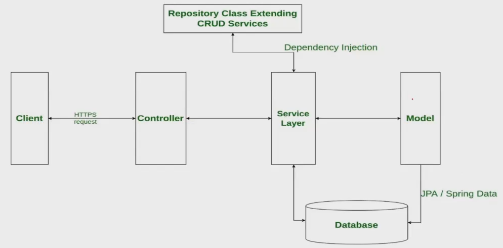

## Spring Data JPA
- JPA stands for Java Persistence API
- Makes it easy to easily implement JPA based repositories
- In an application, implementing data access layer too much boilerplate code has to be written to execute simple queries.
- Spring Data JPA aims to siginficantly improve the implementation of data access layers by reducing the effort to the amount that's actually needed.
- You write your repository interfaces, and Spring will provide the implementation automatically.
- JPA is the specification.
- Hibernate is one of the implementations of JPA
- By default Hibernate is used as default ORM implementation in Spring Boot but if we want other implementations e.g. EclipseLink etc we can do that as well.

### Spring Data JPA Interfaces
- The central interface in the Spring Data repository abstraction is **Repository**
- The **CrudRepository** (I) provides sophisticated *CRUD functionality* for the entity class (Employee) that is being managed.
- On top of the CrudRepository, there is a **PagingAndSortingRepository** abstraction that adds additional *methods to ease paginated access to entities.*
- Spring also provide persistence technology-specific abstractions, such as **JPARepository** or **MongoRepository** etc.

### Settings
- With Spring Boot, add the following dependencies:
    ```xml
        <dependency>
            <groupId>org.springframework.boot</groupId>
            <artifactId>spring-boot-starter-data-jpa</artifactId>
        </dependency>
    ```

- Default Database H2
    ```xml
        <dependency>
            <groupId>com.h2database</groupId>
            <artifactId>h2</artifactId>
            <scope>runtime</scope>
        </dependency>
    ```

- If any other database used e.g. MySQL, use the corresponding dependency for the driver
    ```xml
        <dependency>
            <groupId>com.mysql<groupId>
            <artifactId>mysql-connetor-j</artifactId>
            <scope>runtime</scope>
        </dependency>
    ```

### Sample Repository
```java
package com.mycompany.repositories;

import java.util.List;

public interface EmployeeRepository extends CrudRepository<Employee, Long> {
    /* --- Derived Queries --- */
    List<Employee> findByNameAndSkill(String name, String skill);
}
```

Guide 👉 https://spring.io/guides/gs/accessing-data-jpa/

### Modification Version - 1
- Adding Spring Data JPA Dependency & MySQL
    #### pom.xml
    ```xml
        <dependency>
            <groupId>org.springframework.boot</groupId>
            <artifactId>spring-boot-starter-data-jpa</artifactId>
        </dependency>

        <dependency>
            <groupId>com.mysql</groupId>
            <artifactId>mysql-connector-j</artifactId>
            <scope>runtime</scope>
        </dependency>
    ```

- Create database
    - `create database empDatabase;` : Creates the new database
    - `create user 'springuser'@'%' identified by 'admin';` : Creates the user
    - `grant all on empDatabase.* to 'springuser'@'%'; ` : Gives all privilges to the new user on the newly created database
- Adding properties:
    - spring.datasource.driver-class-name=com.mysql.cj.jdbc.driver
    - spring.datasource.url=jdbc:mysql://localhost:3306/empDatabase
    - spring.datasource.username = springuser
    - spring.datasource.password = admin
    - spring.data.jpa.hibernate.ddl-auto=update
    - spring.data.jpa.show-sql=true

- Annotate @Entity class as under
    ```java
    @Entity
    public class Employee {
        @Id
        @GeneratedValue(strategy=GenerationType.AUTO)
        private Long id;
        private String name;
        private String skill;
    }
    ```

### Testing using Postman
#### GET Method
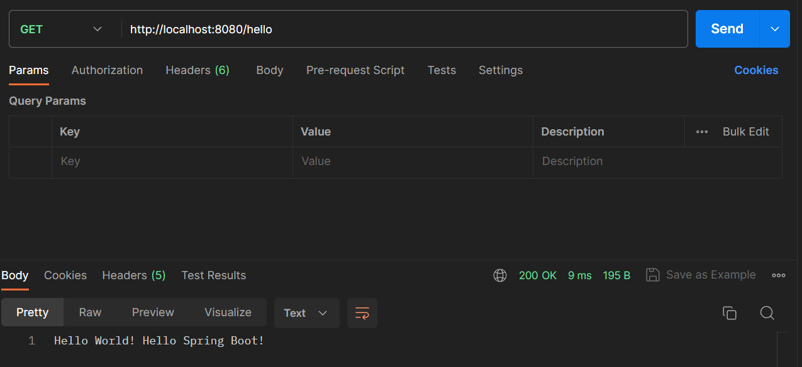

#### POST Method
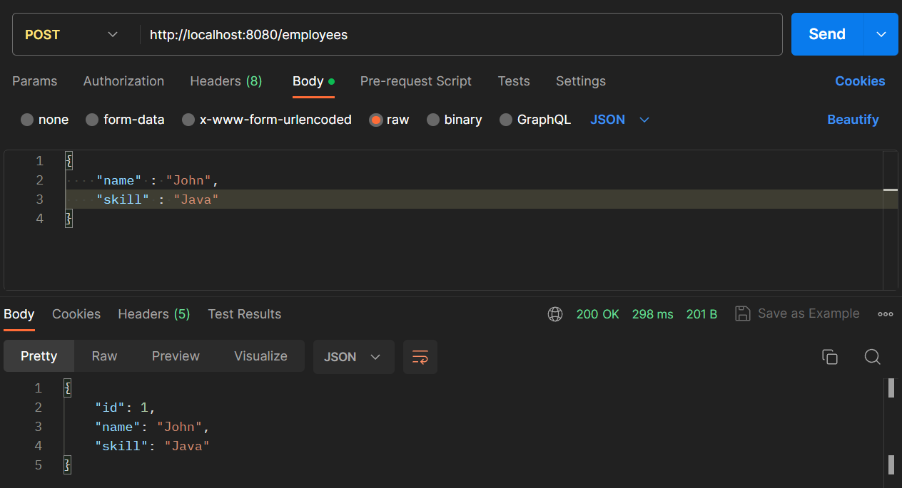

#### Inside MySQL Workbench
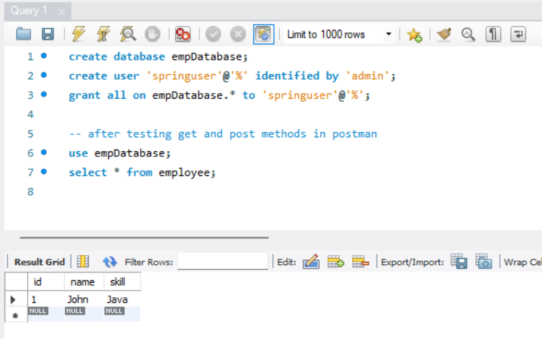

#### POST Method (2nd Request)
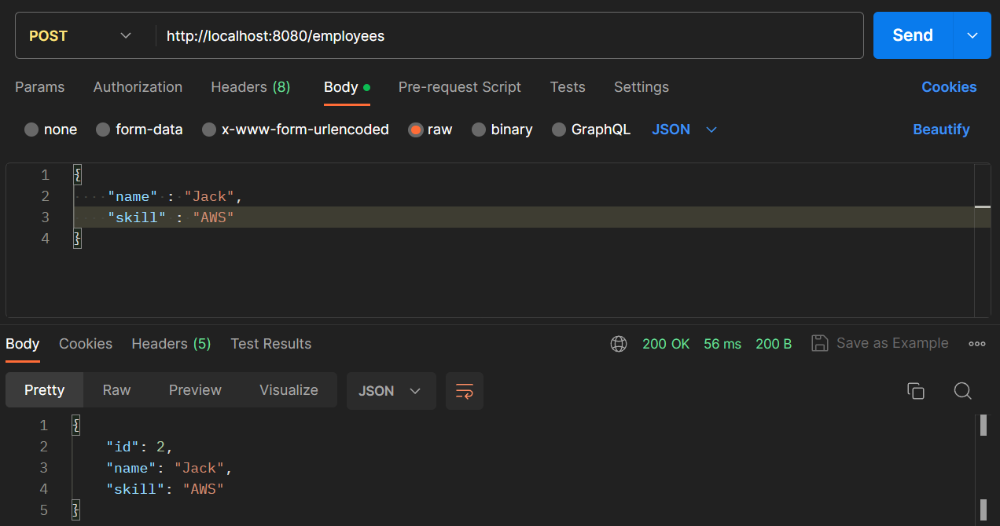

#### GET Method(ID: 1)
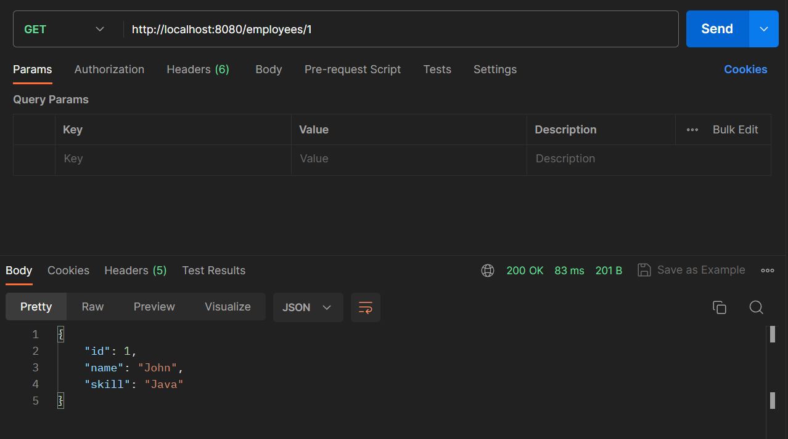

#### GET Method(ID: 2)
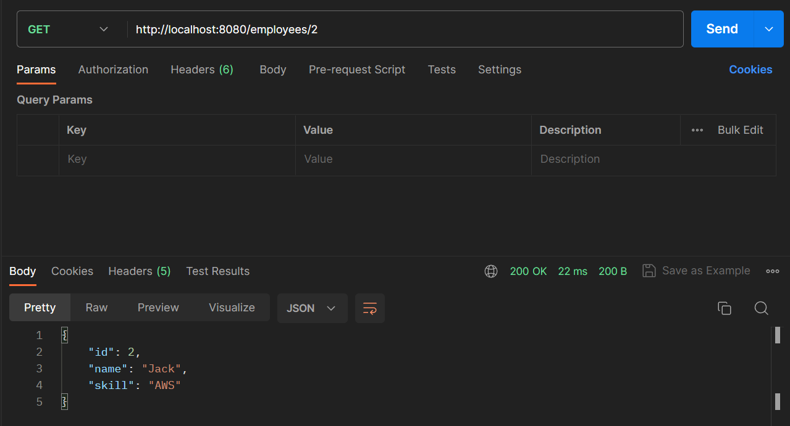

#### Console 
These are the queries being interally fired by the Spring Boot Application 👇 <br/>
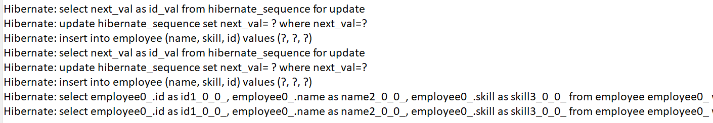

#### PUT Method (Modification)
Postman 👇 <br/>
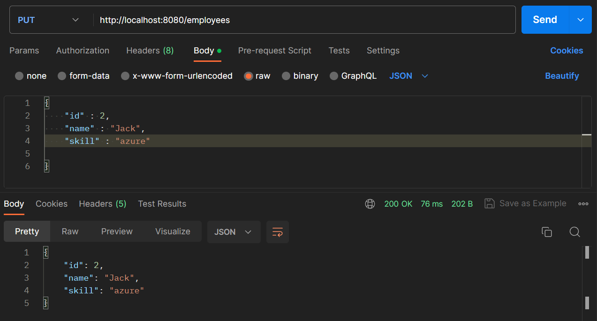

SQL Workbench 👇 <br/>
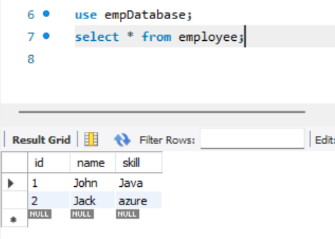

-------------------------------------------------------

## Running Spring Boot Outside the IDE
There are two ways (by navigating to command prompt at the application level)
- mvn spring-boot:run
- java -jar/target/app.jar

### Creating Jar File
Run as --> Maven Build --> Goals: clean package 
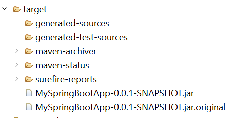

## Adding DevTools Dependency
Copy the dependencies from Spring Initializr

----------------------------------------------------------

## Final Code

#### Project Structure
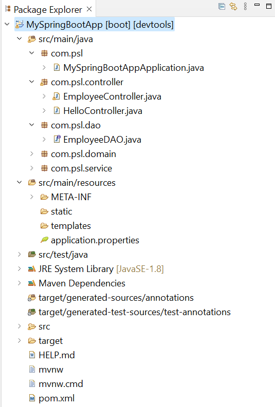

#### pom.xml
```xml
<?xml version="1.0" encoding="UTF-8"?>
<project xmlns="http://maven.apache.org/POM/4.0.0" xmlns:xsi="http://www.w3.org/2001/XMLSchema-instance"
	xsi:schemaLocation="http://maven.apache.org/POM/4.0.0 https://maven.apache.org/xsd/maven-4.0.0.xsd">
	<modelVersion>4.0.0</modelVersion>
	<parent>
		<groupId>org.springframework.boot</groupId>
		<artifactId>spring-boot-starter-parent</artifactId>
		<version>2.7.12</version>
		<relativePath/> <!-- lookup parent from repository -->
	</parent>
	<groupId>com.psl</groupId>
	<artifactId>MySpringBootApp</artifactId>
	<version>0.0.1-SNAPSHOT</version>
	<name>MySpringBootApp</name>
	<description>Demo project for Spring Boot</description>
	
	<properties>
		<java.version>1.8</java.version>
	</properties>
	
	<dependencies>
		<dependency>
			<groupId>org.springframework.boot</groupId>
			<artifactId>spring-boot-starter-web</artifactId>
		</dependency>
		
		<dependency>
        	<groupId>org.springframework.boot</groupId>
        	<artifactId>spring-boot-starter-data-jpa</artifactId>
    	</dependency>

   		<dependency>
        	<groupId>com.mysql</groupId>
        	<artifactId>mysql-connector-j</artifactId>
        	<scope>runtime</scope>
    	</dependency>
    	
    	<dependency>
			<groupId>org.springframework.boot</groupId>
			<artifactId>spring-boot-devtools</artifactId>
			<scope>runtime</scope>
			<optional>true</optional>
		</dependency>
    	
    	<dependency>
            <groupId>com.h2database</groupId>
            <artifactId>h2</artifactId>
        </dependency>

		<dependency>
			<groupId>org.springframework.boot</groupId>
			<artifactId>spring-boot-starter-test</artifactId>
			<scope>test</scope>
		</dependency>
	</dependencies>

	<build>
		<plugins>
			<plugin>
				<groupId>org.springframework.boot</groupId>
				<artifactId>spring-boot-maven-plugin</artifactId>
			</plugin>
		</plugins>
	</build>

</project>
```

#### MySpringBootApplication.java
```java
package com.psl;

import org.springframework.boot.SpringApplication;
import org.springframework.boot.autoconfigure.SpringBootApplication;

@SpringBootApplication
public class MySpringBootAppApplication {
	public static void main(String[] args) {
		SpringApplication.run(MySpringBootAppApplication.class, args);
	}
}
```

#### HelloController.java
```java
package com.psl.controller;

import org.springframework.web.bind.annotation.RequestMapping;
import org.springframework.web.bind.annotation.RequestMethod;
import org.springframework.web.bind.annotation.RestController;

//RESTful Controller
@RestController //@RestController = @Controller + @ResponseBody
public class HelloController {	
	@RequestMapping(value = "/hello", method = RequestMethod.GET)
	public String sayHelloWorld() {
		return "Hello World! Hello Spring Boot!";
	}
}
```

#### EmployeeController.java
```java
package com.psl.controller;

import org.springframework.web.bind.annotation.RequestMapping;
import org.springframework.web.bind.annotation.RequestMethod;
import org.springframework.web.bind.annotation.RestController;
import org.springframework.web.bind.annotation.PathVariable;
import org.springframework.web.bind.annotation.RequestBody; 
import org.springframework.web.bind.annotation.PostMapping;

import java.util.List;

import org.springframework.beans.factory.annotation.Autowired;
import org.springframework.web.bind.annotation.DeleteMapping;
import org.springframework.web.bind.annotation.GetMapping;
import org.springframework.web.bind.annotation.PutMapping;

import com.psl.domain.Employee;
import com.psl.service.EmployeeService;

@RestController
public class EmployeeController {
	
	@Autowired
	private EmployeeService service;
	//Create
//	@RequestMapping(value = "/employees", method = RequestMethod.POST)
	@PostMapping(value = "/employees")
	public Employee addEmployee(@RequestBody Employee e) {
		return service.addEmployee(e);
	}
	//Read 1 Employee
//	@RequestMapping(value = "/employees/{id}", method = RequestMethod.GET)
	@GetMapping(value = "/employees/{id}")
	public Employee  getEmployee(@PathVariable Long id) {
		return service.getEmployee(id);
	}
	//Read all employees - ideally supplied with a boundary condition
		@GetMapping("employees")
		public List<Employee>  getAllEmployees() {
			return service.getAllEmployees();
		}
	//Update
	@PutMapping(value = "/employees")
	public Employee updateEmployee(@RequestBody Employee e) {
		return service.updateEmployee(e);
	}	
	//Delete
	@DeleteMapping(value = "/employees/{id}")
	public void deleteEmployee(@PathVariable Long id) {
		
	}
}
```

#### EmployeeDAO.java
```java
package com.psl.dao;

import java.util.List;

import org.springframework.data.repository.CrudRepository;
import com.psl.domain.Employee;

public interface EmployeeDAO extends CrudRepository<Employee, Long>{	
	/* --- Derived Queries --- */
	List<Employee> findAll();
}
```

#### Employee.java
```java
package com.psl.domain;

import javax.persistence.Entity;
import javax.persistence.GeneratedValue;
import javax.persistence.GenerationType;
import javax.persistence.Id;

@Entity
//@Table("employeeTable")
public class Employee {
	@Id //Primary Key
	@GeneratedValue(strategy = GenerationType.AUTO)
	private Long id;
	//@Column
	private String name;
	private String skill;
	
	public Employee() {}
	public Employee(Long id, String name, String skill) {
		this.id = id;
		this.name = name;
		this.skill = skill;
	}
	
	public Long getId() { return id; }
	public String getName() { return name; }
	public String getSkill() { return skill; }
	
	public void setId(Long id) { this.id = id; }
	public void setName(String name) { this.name = name; }
	public void setSkill(String skill) { this.skill = skill; }
	
}
```

#### EmployeeService.java
```java
package com.psl.service;

import java.util.List;
import com.psl.domain.Employee;

public interface EmployeeService {
	Employee addEmployee(Employee e);
	Employee getEmployee(Long id);
	List<Employee> getAllEmployees();
	Employee updateEmployee(Employee e);
	void deleteEmployee(Long id);
}
```

#### EmployeeServiceImpl.java
```java
package com.psl.service;

import java.util.List;

import org.springframework.beans.factory.annotation.Autowired;
import org.springframework.stereotype.Service;

import com.psl.dao.EmployeeDAO;
import com.psl.domain.Employee;

@Service
public class EmployeeServiceImpl implements EmployeeService {

	@Autowired
	private EmployeeDAO dao;
	
	@Override
	public Employee addEmployee(Employee e) {
		return dao.save(e);
	}

	@Override
	public Employee getEmployee(Long id) {
		return dao.findById(id).get();
	}

	@Override
	public List<Employee> getAllEmployees() {
		return dao.findAll();
	}

	@Override
	public Employee updateEmployee(Employee e) {
		return dao.save(e);
	}

	@Override
	public void deleteEmployee(Long id) {
		dao.deleteById(id);
	}
}
```

#### application.properties
```
spring.datasource.driver-class-name=com.mysql.cj.jdbc.Driver
spring.datasource.url=jdbc:mysql://localhost:3306/empDatabase
spring.datasource.username=springuser
spring.datasource.password=admin

spring.jpa.hibernate.ddl-auto=update
spring.jpa.show-sql=true
```