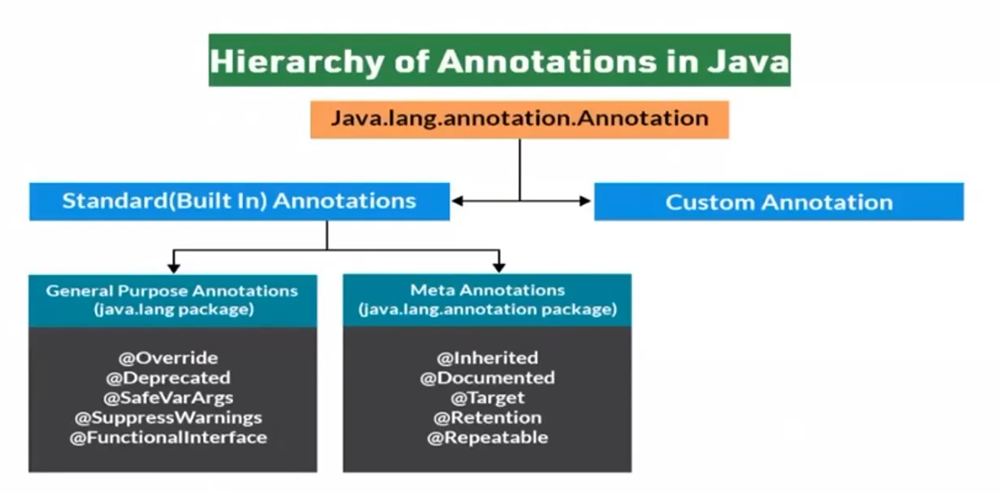

# Session - 6 (Guiding)

# **Spring Boot & Microservices**
## Spring Boot Introduction
- Spring is widely used for creating scalable applications. For web applications SPring provie Spring MVC.
- Spring MVC is a widely used module of spring which is used to create scalable web applications.
- But main **disadvantages** of spring projects is that configuration is really time-consuming and can be a bit overwhelming for the new developers.
- Solution to this is Spring Boot. Spring Boot is built on the top of the spring and contains all the features of spring. And is becoming favourite of develoepr's these days because of it's a rapid production-ready environment which enables the developers to directly focus on the logic instead of struggling with the configuration and set up.
- Spring Boot is a microservice-based framework and making a production-ready application in it takes very less time.

## Spring Boot Features
- Spring Boot is built on the top of the conventional spring framewoek. So, it provides all the features of spring and is yet easier to use than spring.
- It allows us to avoid heavy configuration of XML which is present in spring.
- Unlike the Spring MVC Project, in spring boot everything is auto-configured. We just need to use proper configuration for utilizing a particular functionality. For example: If we want to use hibernate (ORM) then we can just add @Table annotation above model/entity class and add @Column annotation to map it to table and columns in the database.
- It provides easy maintenance and creation of REST end points.
    Creating a REST API is very easy in Sprin gBooot. Just the annotation @RestController and @RequestMapping(/endPoint) over the controller class does the work.
- It includes embedded Tomcat server: Unlike Spring MVC project where we hwave to manually add and install the tomcat server, Spring Boot comes with an embedded Tomcat server, so that the applications can be hosted on it.

- Deployment is very easy, war and jar file can be easily deployed in the tomcat server:
    war or jar files can be direcly deployed on the Tomcat Server and Spring Boot provides the facility to convert our project into war or jar files. Also, the instance of Tomcat can be run on the cloud as well.

- Microservice Based Architecture:
    Microservice as the name suggests is the name given to a module/service which focuses on a single type of feature, exposing an API. Let us consider an example of a hospital management system:
        - In case of monolithic systems, there will be a single code containing all the features which are very tough to maintain on a huge scale.
        - But in the microservice-based system, each feature can be divided in to smaller subsystems like service to handle patient registration, service to handle database management, service to handle billing etc.
    
    Microservice based system can be easily migrated as only some services need to be altered which also makes debugging and deployment easy. Also, each service can be integrated and can be made in different technologies suited to them.

## Spring Boot Architecture
- Layers in Spring Boot: There are four main layers in Spring Boot:
    - **Presentatin Layer** : It consists of views (i.e., frontend part)
    - **Data Access Layer** : CRUD (create, retrieve, update, delete) operations on the database comes under this category.
    - **Service Layer** : This consist of service classes and uses services provided by data access layers.
    - **Integration Layer** It consits of web different web services (any service available over the internet and uses XML messaging system)

- Then we have utility classes, validator classes and view classes
- All the services provided by the classes are implemented in their corresponding classes and are retrieved by implementing the dependency on those interfaces.

## Annotation
- @Retention
- @Target

