# Effective Verbal Communication

# Lesson 1 | 3 Elements of Verbal Communication
How workplace communication is different:
1. **Formal** : Unlike in college, people use language that's suited to a workplace environment. People refrain from using slang, nicknames, etc.

2. **Brief** : Everyone's time is valuable and hence communication tends to be brief and to the point.

3. **Structured** : Work conversations generally aim to achieve some objective, say a decision, or an answer to a question. So workplace communication tends to be structured and solution focused. 

4. **Purposeful** : In order to achieve a goal, people also listen patiently (not just speak) to understand information, and accept valid points. This way the discussion gradually progresses towards its intended purpose.

Good communication skils help you :
1. To put forth your point with confidence
2. To collaborate well with others 
3. To build rapport and strong relationships 
4. To expand your network
5. To create a positive impression about your abilities

### Common communication challenges for new recruits
- **I can't speak my mind confidently** : A common challenge especially among new recruits may be a lack of confidence.
    A new environment, the presence of seniors, etc. might make one apprehensive about speaking up.

    Let's assume that you're in a weekly team meeting and the manager asks everyone for ideas to solve a complex problem. You have worked on something very similar in college and think you may have a good idea.

    But you think it may not be right to say that in front of all the seniors. Also, what if your idea sounds silly to others?
    With those thoughts you keep your idea to yourself.

- **I can't seem to remember information** : Not being able to remember or retain information shared by others could be a result of poor listening skills.

    Let's say you were a part of a conference call with your client and the client was explaining a requirement. You were distracted by your phone, but were listening on and off. At the end of the call the entire team started discussing the requirements shared but most of the conversation sounded like Greek and Latin to you!

- **I can't keep my messages short..** It is a skill to be able to express yourself in very few words.
    In a meeting with your manager, you try to explain a problem you're facing. It takes you a really long time to get to the point and by then, your manager and there's no time to discuss solutions. Long and winding messages take too long to convey and also confuse and bore people. (Lengthy/extended winding)

- **I can't make my messages interesting..** While presenting information, one may find it difficulut to keep the audience's interest levels up.

    For example, you're doing a presentation for your client. Your presentation may become uninteresting if you don't use a variety of communication elements like a different tone, eye contact, etc. This could make your presentation unimpactful.

- **I can't express myself clearly..** A communication challenge often encountered is the inability to express oneself clearly.
    Assume you're in a team meeting. While you are sharing some information, your message lacks a structore or a sequence of points. This may leave your colleagues confused as they might not understand your message.
 
One needs to up one's communication game at work to overcome these challenges and be successful. 

### Becoming more effective
So how do I go about making my communication (speaking and listening) at the workplace better? How can I become more confident while communicating?

We'll start off with speaking first. 

## The Mehrabian Principle
There are 3 elements of effective communication (Mehrabian Principle):
1. **Words** : Pronounication, 7Cs, Positive Language
2. **Tone of Voice** : Volume, Pace, Pitch, Intonation, Stress
3. **Body Language** : Eye contact, Facial Expressions, Hand Gestures, Posture, Appearance

Everything should be in a sync.

### 1. Body Language
#### Appropriate
1. Brief but genuine eye contact with the listeners helps you connect with them.

2. Pleasant facial expressions and smiling often makes you seem more approachable.

3. a. While speaking, letting your hands move freely adds to your comfort and help to emphasize important points.  
   b. A firm handshake indicates confidence.

4. An upright posture while sitting, standing, or walking is a sign of good energy and conv iction.

5. Dressing in work-appropriate clothing and being well-groomed makes you feel good! It demonstrates a commitment to the job. 

#### InAppropriate
1. a. Avoiding eye contact with seniors might make you seem timid or unconfident.  
   b. Staring at anyone in a group setting could make them uncomfortable.

2.  Unpleasant or negative expressions like a smirk, anger, irritation or rolling eyes, etc. when in a group could make you come across as impatient, unpleasant, or aggressive.

3. Inappropriate hand gestures at a work setting eg. facepalm, keeping your elbow on someone's chair or shoulder are a sign of being too casual in a formal setting.

4. Slouching can make you seem tired, unconfident or simply, disinterested. While sitting, reclining too much or leaning on to the adjacent chair also makes you appear disinterested.

5. Using loud clothes or accessories shows a casual attitude towards work.

### 2. Tone of Voice
Tone comprises of Volume, Pace, Pitch, Stress and Intimation  
✅ Volume --> Moderate   
✅ Pace --> Moderate with Pauses  
✅ Pitch --> Low  
✅ Stress --> On Key Words  
✅ Intonation --> Vary

Try to minimize *forkhorns.*

#### Match the Following:
- Appropriate :
    - Smiling at everyone as you enter a meeting room
    - Intonating while giving the client a presentation

- Inappropriate :
    - Speaking on your desk phone in a loud voice
    - Avoiding eye contact with senior manager
    - Crossing your arms while speaking to a colleague

### 3. Words
The third element in the Meherabian principle describes language aspects to make communication purposeful.

#### Pronounciation
Pronouncing words correctly helps convey the message without any confusion. For example, you want to say the word 'cache' (pronounced cash), but you pronounce it as 'catch', it might confuse the listener.  Good pronunciation is also a sign of a competent communicator. 

#### 7Cs of Communication
- **Clear** : When speaking, have a clear objective in mind and convey it using simple, structured and grammatically correct sentences.  
    - Say: We need the client's approval urgently for the licensed software.
    - Don't say: Client approval for licensed software urgent. 

- **Concise** : Keep messages crisp and precise. Avoid long and winding messages and filler words such as 'like', 'you know' etc
    - Say: I'm sending you the final code for review in an hour.
    - Don't say: I'll send you the finalized version of the completed code for you to review in like, an hour.

- **Concrete** : Be specific in your communication. Use facts and figures wherever possible. Avoid vague and ambiguous statements.
    - Say: I still need to fill out item 2 in the report, I'll send it to you by 5pm today.
    - Don't say: I'm almost done with the report and then will send it to you soon. 

- **Coherent** : Your message should make sense to the audience. Ensure that it flows logically. Avoid covering too many unrelated points in one go.
    - Say: I have a question about Phase 2 and 3 of XYZ and the client presentation. What is the expected output for phase 2? How did we arrive at the calculation in phase 3? How many slides do we need for the client presentation 
    - Don't say: I have a few questions about Phase 1 and Phase 2 of XYZ. How did we arrive at the calculation in phase 3? Actually for phase 2, it was based on simple interest. For Phase 2, what is the expected output? What about the presentation?

- **Correct** : Ensure that your message has accurate details and when you convey it, do so with conviction.  When you sound uncertain or confused, you confuse people as well. 
    - Say: There are 3 critical defects that need to be fixed and the client wants an update about the fixes by Tuesday.
    - Don't say: I think there are 2 or 3 critical defects to be fixed, I think the client wants an update by Tuesday, or was it Monday? 

- **Courteous** : When you speak courteously, people feel respected and receive your message positively. Use courtesy words like 'please', 'thank you', sorry' etc. as appropriate in your conversations.
    - Say: Could you please help me with this code?
    - Don't say:  Help me with this code.

- **Complete** : Share all relevant details pertaining to a topic. This will help people to understand the bigger picture and to take the required action.  Incomplete information may lead to the receiver taking incomplete or incorrect action. 
    - Say: The meeting has been planned to discuss possible solutions to the xyz issue reported by the client. Please be prepared with all previous emails, reports and documentation shared with the client.
    - Don't say: Please be prepared for meeting.

#### Mathch the following:
- Concrete : I'll send you the report shortly.
- Courteous : Finish these this task on priority.
- Concise : In my humble opinion, the solution that will help us best address this problem is xyz.

**The Mehrabian Principle** focuses on sending messages through our body language, tone and words.  
We spend between 70% - 80% of our day engaged in some form of communication, and about 55% of our time is devoted to listening.

#### Active Listening
Active listening is the ability to focus completely on a speaker, understand their message, comprehend the information and respond thoughtfully. 

Unlike passive listening, which is the act of hearing a speaker without remembering their message, this highly valued skill ensures that you’re able to engage and later recall specific details without needing information to be repeated. 

Active listening at work helps you:
1. to understand every small, critical detail of your conversations with managers, clients and colleagues that you wouldn't if you were distracted. 

2. to retain more information easily and adds to your knowledge database. It will also help you better understand new topics and remember what you’ve learned so you can apply it in the future. 

3. to spot problems early on and work towards a solution. Good listeners are like doctors - they listen carefully and hence are able to quickly diagnose the problem and treat it!

4. to build your reputation as a reliably employee. Listening helps you achieve the outcome because you know exactly what needs to be done. People trust you better and that also improves relationships.

### Becoming an Active Listener
Here are some pointers to help you become an active listener:
- **Be open minded:** Active listening requires one to be open minded towards learning something knew. Refrain from making judgements about the topic or the speaker too soon.

    For example, you're asked to attend a meeting about an unfamiliar topic, go into the meeting eager and with an open mindset.

- **Use appropriate body language:** Face the speaker: Pick a spot where you can see the speaker and the speaker can see you. Orient yourself towards him or her and maintain regular eye contact. 

    Maintain eye contact: Always keep your eyes on the speaker and avoid looking at other people or objects in the room. 

    Nod to acknowledge: Offering the speaker a few simple nods shows you understand what they’re saying. A nod is a helpful, supportive cue, and doesn’t necessarily communicate that you agree with the speaker—only that you’re able to process the meaning of their message.

- **Ask questions:** Asking the right kind of questions to get more information on a certain topic. Listening is not just about receiving information given to you, but also asking for more information to enable you to get a clearer picture of the topic under . 

    You could ask  
    a) Open ended questions: These questions allow the other person to describe something in detail.
    You could ask a client, "What features would you like me to work on this week?" 
    This will help you give you the details you require.

    b) Closed ended questions: these questions are usually answered with a "yes" or a "no".
    Asking your client, "Can I share the bug fix report with you on Thursday?" is an example of a closed ended question.
    It will help you come to quick decisions or conclude a certain topic.

- **Paraphrase** : To paraphrase is to reword the speaker's message in your own words to show you fully understand their meaning. This will also give the speaker an opportunity to clarify vague information or expand their message. 

    For example, in a meeting with your manager, you could paraphrase at intervals to clarify various points. 
    
    "So what you're saying is that I need to set up a demo for the client this week, send out meeting invites, and keep the set up ready on the day?"
    
    Your manager can either confirm, or clarify if you're missing anything.

- **Take notes** : Sometimes it can become difficult to remember every single detail from a conversation. Taking brief notes while listening to the speaker will save you the trouble of memorizing and you'll be able to refer to your notes at a later point when needed.

- **Keep away distractions** : Active listening requires us to be completely focused on the conversation.  Avoid being distracted by your phones or any other work during the conversation. Being distracted not just affects our ability to listen but it is also disrespectful to the speaker. 

- **Be patient** : When the topic of conversation doesn't interest us, or we get restless and want the conversation to get over quickly. When we have an interesting idea to share, we become impatient to share it. During both these instances, our listening skills take a hit. 

    Ensure that you always give the speaker patient attention and let him or her finish, whatever the topic. Avoid interrupting the speaker unless absolutely required.

Which of these make one an active listener? --> Paraphrasing the message, Asking open minded questions

### Summary
1. Effective communication is a critical skill at the workplace that helps us to achieve work goals and build relationships
2. Workplace communication tends to be formal, structured and brief.
3. According to the Meherabian principle, the three elements that make communication impactful are Body language, Tone of voice and Words.
4. The three communication elements need to be used together to help the listener understand our message clearly.
5. Active listening is as important as speaking and helps us gain more information and retain it for longer.

--------------------------------------------------------------------------

# Lesson 2 | Listen Closely Before You Speak

#### Productive Conversations Involve “Give and Take”
That’s why perhaps one of the most critical strategies when having difficult conversations is making an effort to be a good listener.

### The Do’s and Don’ts of Effective Listening
- **Do** : Do make good eye contact. Listen with the same effort you'd use in trying to persuade the person you disagree with.
- **Don't** : Don’t talk over the other person or worry about remembering every detail they’ve said to you.

Everyone wants to be seen, heard, and validated. So when you listen—and do so attentively with good eye contact—it tells people that you see their humanity and that they matter. Without this, difficult conversations can devolve into people talking past each other.

--------------------------------------------------------------------------

# Lesson 3 | Support, Rather Than Shift, the Conversation

- The best listeners are often the best questioners
- Balance shift and support responses

### Shift Responses vs Support Responses
In conversation, there are two types of responses: shift responses and support responses. **Shift** **responses** direct attention away from the speaker and toward the respondent. 

On the other hand, **support** **responses** encourage elaboration from the speaker to help the respondent gain a better understanding.

- **Shift Response** : The first reply—"Oh man, my dog Sparky is always running away, too"—is a classic example of what sociologist Charles Derber calls a shift response. To us, mentioning Sparky may seem appropriate. 

    After all, we’ve shared a similar experience, so why wouldn’t we bring it up? The issue is that these shift responses are usually self-referential statements, attempts to shift the conversation away from the original speaker and toward ourselves. 
    
    It’s not an intentionally selfish act, but it is symptomatic of conversational narcissism—the opposite of good listening and connection-building.

- **Support Response** : The second reply—“Oh no, where did you finally find him?”—is more of a support response. Support responses are usually not self-referential statements—or hasty advice—but open-ended, other-directed questions. 

    Indeed, the best listeners are often the best questioners. You have to listen to ask an appropriate question. And then, as a consequence of posing the question, you are invested in listening to the answer.

#### Match the following:
- Shift Response :
    - Me too! My to-do list is a mile long this week.
    - Seriously? You have a dream job. Mine on the other hand..
    - My spouse is swamped this week, too. We had to cancel dinner plans yesterday.

- Support Response :
    - What do you need to get done?
    - Is there anything I can do to help you?

### Finding the Right Balance
So, if shift responses hinder elaboration, should we always opt for support responses instead? In the case of the coworker’s dog, for instance, is mentioning your dog, Sparky, off-limits? The short answer is no. Mentioning Sparky is fine—just maybe not right away, not until the other person feels heard.

Monitor the balance of shift and support responses in your conversations, and remember the advantages of becoming a good questioner. People who ask questions collect stories the way others might collect stamps, shells, or coins. As a result, they tend to have something interesting to contribute to almost any discussion.

--------------------------------------------------------------------------

# Lesson 4 | Listening to More Than Just Words

### The Role of Nonverbal Communication
Imagine this: You’re standing backstage with your coworker Jamal, who’s about to give a presentation to a large crowd. “You’re going to do great,” you whisper. Nodding, Jamal lets out a slow breath. You notice his hands shake as he gathers his notes and steps on stage.

How do you think Jamal is feeling about the presentation? Even though he didn’t say it, you can tell Jamal is nervous. According to Kate Murphy, nonverbal communication is an important indicator of how someone feels—perhaps more important than the words they use.

### Verbal vs Non-Verbal Communication
Many of us focus on what people say rather than how they say it. However, words play a surprisingly small role in our overall communication. The pie chart below breaks down the role of words—along with body language and tone of voice—in how we interact with others.

According to research—and as shown in the chart above—nonverbal communication is the most important indicator of what someone is really thinking and feeling. While words account for just 7% of our overall communication, facial expressions convey about 55% of the emotional content of a spoken message, and tone of voice claims the remaining 38%.

## Best Practices for Understanding Non-Verbal Communication

### Strategy 1
#### Avoid Distractions
For starters, avoid distractions. Refrain from gazing out a window or checking your phone while listening to someone, as you might miss critical nonverbal cues. Keep your phone tucked away and attend to face-to-face interactions to boost nonverbal listening skills.

In one study of children at a device-free outdoor camp, researchers found that after just five days without phones or tablets and interacting with peers, kids were able to accurately read facial expressions and identify people’s emotions in photos and videos significantly better than kids in the control group who had not attended the camp and continued using devices.

### Strategy 2
#### Monitor Your Own Nonverbal Signals
Monitor your own nonverbal signals while listening to someone else speak. To encourage open and honest communication, adopt what Murphy calls the “listener’s demeanor”—a calm expression that transmits interest and acceptance. Eyes don’t dart or wander, fingers don’t fidget, and the body seems relaxed and open, which means no crossed arms or legs.

With the listener’s demeanor, there is no indication that you’re on a schedule or that you’d rather be somewhere else. Murphy describes one black-belt listener as “sitting with her elbows bent in front of her on the table, cheeks resting in her hands, eyes wide, listening like a rapt teenager.”

--------------------------------------

# Assess

1. Which of these is a part of 7Cs of communication? --> **Correct**
2. The Mehrabian Principle focuses on sending messages only through body language? --> **FALSE**
3. Which of these is not a part of 7Cs of communication? --> **Candid**
4. Good communication skills help you to:
    - Put forth your point with confidence
    - Build rapport and strong relationships
    - Create a poitive impression about your abilities
5. Tone of Voice comprises the: **Volume, Pace, Pitch, Intonation**

--------------------------------------------------------

# Assertive Conversations at Work

### Workplace Scenarios
#### Scenario 1
You are in a meeting with some senior managers and colleagues discussing ideas for an upcoming project. You have some ideas of your own as you had done some research earlier for your college project. What do you do?

1. Keep the ideas to yourself. what if everyone thinks those are silly? ❌
2. Share your ideas, they might like them ✅

#### Scenario 2
You're on a call with the client and she wants some tasks to be completed within the hour. You realize that you would need more time considering all the steps involved. What do you do?

1. Agree to do it, knowing that it won't be possible ❌
2. Discuess the steps involved and request for more time ✅

#### Scenario 3
You are worknig with a colleague on a task. During one of your discussions, you don't seem to agree with a certain method and you think you might have a better idea. What do you do?

1. Tell him that his idea makes no sense and then share your idea ❌
2. Tell him that his idea is great, and share yours too ✅

## What is Assertiveness?
- Assertiveness at the workplace is a key communication skill that allows you to speak up for yourself in a manner that is respectful and appropriate for the work environment. 
- Assertiveness means being confident in communicating your needs, opinions, or requests without being pushy, while respecting others' needs, opinions and requests. 
- Assertiveness is about creating the balance.
- It is a communication technique that builds relationships.

### What do you mean by "My right.."?
1. ..to express your feelings
2. ..make a request
3. ..to fail
4. ..to be listed to

and vice-versa (other's right).

### Advantages of Assertiveness
-  It helps you express yourself confidently and without having to constantly worry about being judged. For example, you can share your ideas confidently in meetings even in the presence of seniors.

-  It helps build trust and as a result, you share healthy relationships with your team. Assertiveness enables you to be honest with others creating transparent relationships.

- It earns you respect, because you are respectful of others and you also respect yourself.

- It reduces stress. When you are assertive, you feel confident in expressing your concerns and contributing to resolving problems or issues. You also feel empowered to calmly cope with interpersonal issues as they arise. All of this contributes towards a more positive work environment for everyone.

- It enables you to contribute to the team's success. Assertiveness helps share and accept feedback in a positive manner. And with the help of feedback, you're able to direct your best efforts towards the team's goals, inching closer to success.

#### Assertiveness is
- to be respectful towards others
- to state your views confidently
- to understand other's point of view

### What stops us from being Assertive?
- **Cultural and General Influences**  
    Some cultures do not view assertiveness as a valuable trait and hence do not encourage it. So some of us may have grown up thinking it's wrong to voice our opinions because it may upset or offend others, while some others may have grown up not even knowing what assertiveness is.

    Additionally, cultural influences teach us to keep our opinions to ourselves especially when elders are involved. We tend to carry the same ideology to the workplace and may feel uncomfortable speaking up in front of seniors or more experienced peers.

- **Self-Defeating Beliefs**  
    Self-defeating beliefs are at the root of low self-esteem. It is when you think you're not good enough or you're not as good as someone else. If you have low self-esteem, you won't value your needs, skills, opinions, or ideas, you'll constantly think they're not worthy of being acknowledged. 
    
    Assertiveness begins with valuing yourself - your needs, feelings, thoughts, opinions, etc. Without it, you will find it very difficult to stand up for what you believe.

- **Skills Deficit**  
    It may be that we just don’t have the verbal (words) and nonverbal (body language and tone) skills to be assertive. We may watch other people being assertive and admire their behavior but have no real idea how to be like that ourselves. 

So those who aren't assertive, employ other behavior styles. To understand assertive behavior a little better, it would help to understand these other behavior styles as well.  

## Different Behavior Styles
A behavior stems from our thoughts, feelings and emotions in different situations. How we display these emotions through our actions will determine our behavior style. 

Remember the Meherabian principle? It also applies here. With different behavior styles, people use body language, tone, and words differently. So as we go ahead and talk about behaviors, we need to remember that it comprises these communication elements as well.

Let's also remember that every behavior has consequences. How you choose to act in different situations will impact what happens next.

The video you watched before, talks about two other behaviors besides Assertiveness.  In the video that you're now going to watch are detailed descriptions of all three behavior styles.

As you watch, try a little self-evaluation. Figure out which behavior/behaviors you tend to use and think about what consequences those behaviors have led to, in the past. It will help you understand if there's anything you need to change in your interactions at work.

It might be helpful to consider behavior styles as being on a continuum. On one end of the continuum is passive behavior, in the middle is assertive behavior, and at the other end is aggressive behavior.

## Four Ways to Recognize
1. Words
2. Vocal & Speech Patterns
3. Facial Expressions
4. Posture & Gesture

### Typical Words and Phrases
- **Passive** : Perphaps, maybe, probably, Could you..?, Okay, if you say so, alright
- **Aggressive** : Critical Language, Direct Instructions: Do, Don't, You must, you will, implied threats: if you..
- **Assertive** : Direct, Will you..?, Would you..?, Yes, No, I, You, We, Patience, Courtesy, Politeness: Please, Thank you

### Typical Voice and Speech Patterns
- **Passive** : Hesitancy, Quiet speaking, Breathy, High-piched, Monotone, Throat-clearing, coughing
- **Aggressive** : Loud, commanding, Abrupt, Strident, Emotional, Fast, Rising in tone
- **Assertive** : Deep, Resonant, Strong, Clear, Direct, Fluent, Steady, Animated, Even, Emphasis, Pauses

### Typical Facial Expressions
- **Passive** : Evasive, Looking down, False smile, Poor eye contact
- **Aggressive** : Direct eye contect - stare, Jutting Chin, Clenched Jaw, Frownm Scowl, Cleched Teeth, Pursed Lips
- **Assertive** : Relaxed, Genuine Smiling, Good Eye Contact, Animated and Alive

### Typical Body Languages
- **Passive** : Hunched, Slouched, Stepping Back, Turned Away, Arms Crossed, Self-Hugging, Asymmetry, Fidgetting, Jittery, Touching -> Rubbing Neck, Holding Wrists 
- **Aggressive** : Stiff, Rigid Tight, Fists Clenched, Pointy Finger or Thumb, Hands or Hips trying to look Biggger, Striding, Defensive Arms Crossed
- **Assertive** : Open, Symmetrical, Palms Up, Palms Down, Upright, Square-on, Relaxed

## Passive Behavior
### Consequences of Passive Behavior
1. You could get caught between a vicious cycle of low self-esteem and poor performance.
2. It leads to stress and anxiety as you constantly bottle up your feelings.
3. You could be bullied by others or be taken advantage of, as you can't say 'No'.
4. You come across as unconfident and might lose out on career opportunities.
5. You end up having to live with choices others make for you

*Although you may seem selfless, cooperative and may escape uncomfortable situations in the short run, in the long run, you're letting giving up control of your own life.*    

**"I LOSE, YOU WIN"**

## Aggressive Behavior
### Consequences of Aggressive Behavior
1. You could come across as selfish and people may resent you.
2. You are less likely to develop healthy relationships or may damage existing ones
3. Your inability to get along with people may affect your career growth
4. It is difficult to get the support and help of colleagues in difficult times
5. Constant thoughts about proving your superiority might stress you out

*So, in the short run, although it might seem like you're controlling everything and everyone, eventually you'll find that you're not liked or respected and thus, alone.* 

**"I WIN, YOU LOSE"**

## Assertive Behavior
### Consequences of Assertive Behavior
1. Your self-esteem improves as you communicate your true thoughts openly.
2. As you respect others, they respect you back.
3. Your share healthy work relationships based on trust.
4. Your confidence, honesty, and people qualities help your career growth.
5. You develop 'resilience', the quality that helps you bounce back from setbacks

*Being assertive may not be easy or come naturally, but it will help you be comfortable in your skin and lead an overall stress-free life in the long run.* 

**"I WIN, YOU WIN"**

## Examples
### Passive
- Sitting at the back in a training room as you feel uncomfortable at the front

- Feeling awkward when a colleague compliments you on your work

- Hesitating to ask you manager for help as she seems busy

### Assertive
- Politely but telling a colleague how you don't like being made fun of constantly

- Apologizing to the client for an error and getting down to fixing it.

- Raising your hand at the end of a team meeting to ask a question

### Aggressive
- Blaming another colleague when your manager point out a mistake

- Snapping at a team member doesn't see, to be getting a task

- Shooting down a colleague's idea in the meeting

## Steps to be Assertive at the Workplace
### Step 1 | Identify Needs
- *This task is new and complex. I'm worried I won't be able to complete it without help*

### Step 2 | Work out Options
- *I could ask Karthik for help, but he seems busy. I probably shouldn't bother him*

- *Karthik seems busy. But, I could at least ask him if he has a few minutes to spare to help me understand this task*

- *Maybe I just won't do the task. It's unfair that I'm given a task I have no idea how to do it*

### Step 3 | Understand Consequences
- *If I don't ask Karthik at all, I might do the task incorrectly and there'll be rework*

- *If I tell him, I'm having a tough time understanding this task. He'll provide some help and I can complete the work*

- *If I don't do the task at all, it could affect Anisha's work as that depends on my tasks.*

- *I think I'll speak to him, that's the best thing to do*

### Step 4 | State Needs Clarity
- *Hi Karthik, I can see you're busy. But could you please spare some time in the day to help me with the new task? I've never done it before and it seems a little complex.*

### Step 5 | Listen to, and understand response
- *Of course, I'll help you! How about I finish a quick meeting and then we can catch up in 30 minutes?*

- *That would be great! Thank you. I'll set up a meeting.*

## Points to Remember
- **I can be assertive and so can others**
    Let's remember that while assertiveness gives us the freedom to voice our opinions, it also involves being open to receiving assertive behaviors that others exhibit.

    For example, a colleague gives you feedback about your code, you must be open to the feedback and not get irritated.

- **Assertiveness will not always get me what I want**
    Assertiveness gives us an opportunity to speak up, but it doesn't guarantee that things will always go your way. Assertiveness is accepting unfavorable outcomes also.

    For example, you may ask your manager for a day off, but the project is at a critical stage and so the manager asks you to postpone your leave. I need to understand and accept that.

- **I may employ more than one behavior style**
    Through the course of our interactions at work, we may need to employ non-assertive styles at times.

    For example, if you're constantly being bullied by your colleague into taking on his or her work, you might need to use a little verbal aggression to ensure that this stops.

## Summary
1. Assertiveness is a skill that helps you communicate your thoughts and views in a confident and respectful manner.
2. Assertiveness entails valuing your own rights, needs, opinions, ideas, and those of others as well. 
3. Passiveness and Aggressiveness are non-assertive behaviors and are not conducive to successful workplace interactions and relationships.
4. A passive person values others' 'Rights', needs, opinions, ideas over those of his/her own. This could lead to a person not being taken seriously.
5. An aggressive person values his/her own 'Rights', needs, opinions, ideas violating those of others. This could lead others to resent the person.

-----------------------------------------------------------------

# Writing Effective Business Emails

# Lesson 1 | Written Communication

### Advantages of Emails
1. Emails are a fast way to communicate messages regardless of location.
2. An email can be sent to multiple people at the same time
3. Complex information can be shared easily through emails
4. Emails become documented evidence of the information exchange
5. Information on an email can be retrieved at a later time for reference

### What is Email Etiquette?
Email etiquette refers to the principles of behavior that one should use when writing or answering email messages. It is also known as the *code of conduct for email communication.*

### The Need for Email Etiquette
The way you communicate reflects the type of employee you are: *your work ethic, professionalism, and attention to detail.* Email etiquette helps to streamline communication and make the information you are sending clear and concise. 

Here's why we should always follow email etiquette:
- **Professionalism** : Using proper email etiquette conveys a professional image of you and the overall organization when you're interacting with outsiders like clients.
- **Efficiency** : Emails that adhere to etiquette are more direct and convey the message quickly.
- **Prevention of Misunderstandings** : Practicing email etiquette will help you reduce the likelihood of mistakes that lead to confusion or misunderstandings.

## Practicing Email Etiquette
There are four important facets to practicing email etiquette:

### 1. The 7Cs of Communication
*Clear, Concise, Concrete, Coherent, Correct, Courteous, and Complete.* We have covered the 7Cs in the first lesson, 'Effective Communication'. The 7Cs have a place of significance while writing emails as well. Ensure that you incorporate these 7Cs into your emails.

- **Clear** : Email should be comprehensible with easily understandable data
- **Concise** : Email should be brief and precise
- **Concrete** : Email should have specific information like facts and figures
- **Coherent** : Email should make sense with a logical sequence of data
- **Correct** : Email information should be accurate
- **Courteous** : Email should have a polite tone with words like 'thank you', sorry', 'regards' etc.
- **Complete** : Email should contain all the details the reader would need to take action

### 2. The Guffey's 3x3 Process
Just like verbal communication, email communication also needs effort. An email must be well thought out and well structured. And that's why it's important to follow a systematic process to write it. This process is the 'Guffey's 3X3 Process'.

Developed by Dr. Mary Ellen Guffey, a professor and author, this process helps you put together information into a neat package. It helps ensure that your emails are understood correctly and get you the desired response. Remember intent vs. impact? 

The process comprises three steps:

#### Step 1 | Pre Writing 
The first thing to do is tackle all the necessary planning for your email. Thinking thoroughly about your email’s purpose and intended reader will motivate you to write with the reader’s benefit in mind. 

Prewriting includes three sub tasks:
1. ANALYZE
    - **Why** - The purpose of your email
    - **What** - The content of the email
    - **Who** - The recipients of the email
    - **When** - The right time to send the email
    - **How** - The right channel - is an email enough to explain the content? 

2. Anticipate  
    Knowing who you’re writing to and for gives you direction to write effective emails. So anticipate your recipients and the kind of response they might have to the email. Will they be left confused? Will they be able to execute the desired action?
    
3. Adapt  
    Prepare to adapt your email content to accomplish this goal. Choose a writing style that your recipients will find easy to understand and include all the data they would need to take the desired action.

*It is recommended that you spend 25% of your email writing time on pre writing.*

#### Step 2 | Writing
This is when you’ll get all the information you need to put together your email based on your Pre writing.

Writing includes three sub tasks:
1. **Research**  
    You want the email to be accurate. So collect your information from proper sources - previous emails, discussions with managers or colleagues, files on your machine etc.

2. **Organize**  
    Organize all of the major points and their sub points in your email draft. This step ensures that your email has a logical flow and sequence.

3. **Compose**  
    Now it's time to fine tune your email. Draft your email keeping in mind all the points from the pre writing step. Include all the necessary information.

*It is recommended that you spend 25% of your email writing time on writing.*

#### Step 3 | Revising
After writing the email, it is important to read it once again to ensure that it is error free.

Revising includes three sub tasks: 
1. **Revise**  
    Re-read your email to ensure that the language is clear and readable and that the overall flow is comprehendible.

2. **Proofread**  
    Go over the email with a fine toothed comb and identify spelling and grammar errors if any, and correct them. Remember, that an email rife with grammatical and spelling errors creates a poor impression about the writer.

3. **Evaluate**  
    At this last step, evaluate if your email has all the important elements - correct recipients, subject line, salutation, opening and closing, attachments - and is ready to be sent. 

*It is recommended that you spend 50% of your email writing time on revising.*

Revising is about identifying and correcting --> Spelling errors, Grammar errors, Information errors

### 3. Parts of the Email
An email has several parts from its start to its end. Applying etiquette also means that we should pay attention to each part while writing or responding to emails.

### Recipients
It is addressed to Rajshree and Rajshree name appears in two sections.  
But the email also mentions Shruti's name, but Shruti is not the recipient.

**Incorrect Version of the Email** 👇  
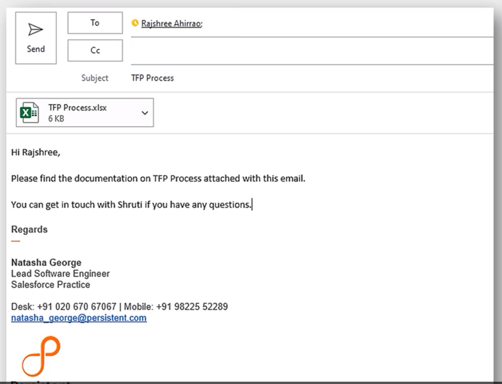

When an email is not marked to the right cc then:
- It creates confusion and ambiquity
- Possibility of missing out information

When writing an email remember to include:
- *To* - People who need information or who need to take action
- *CC* - People who are indirectly involved in the conversation or those who only need to know about it

In this case, Shruti needs to know that Rajshree can approach her for help, and that's why she needs to be marked in CC.  
People in CC are not expected to respond to email.

**Correct Version of the Email** 👇  

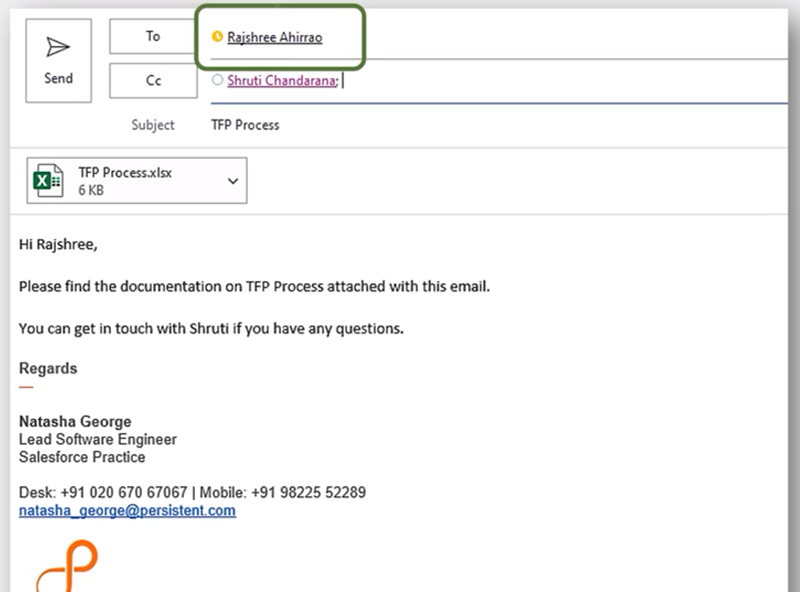

 

### Salutation
This email has no salutation 👇

An email without a salutation:
- seems abrupt
- sets a wrong tone for the email

Using salutation starts the conversation of the email :
- and makes the interaction personalized
- start with a *Hi* and the receiver's first name
- use *Dear Mr.* or *Dear Ms.* based on the preference

This email has salutation 👇
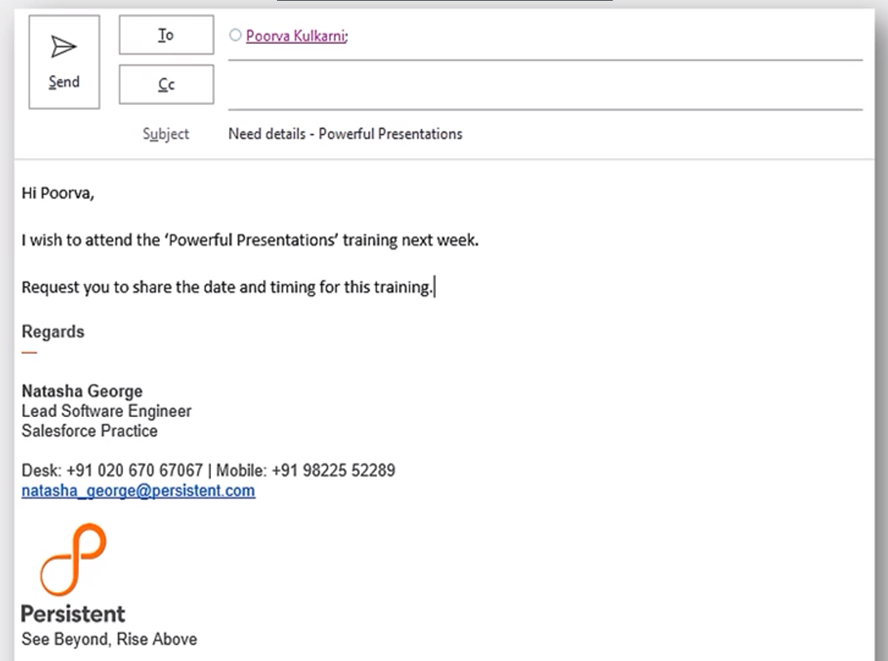

### Subject Line
The subject line status report is very vague. 👇
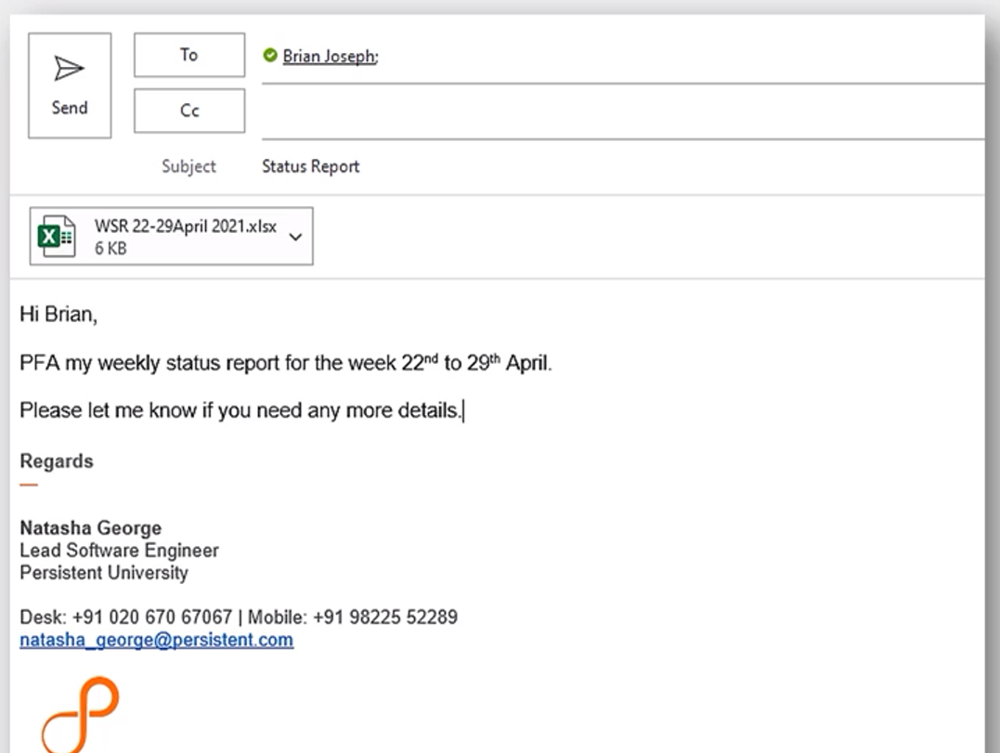

A vague subject line :
- does not communicate the purpose of the email
- and hence may not be read immediately or be given priority
- it also might make it difficult to retrieve at a later date

We ensure that the subject line:
- **C** : Concise; *The subject line should be as brief as possible.*
            Avoid redundatn words like regarding, about, etc.
- **A** : Appropriate; *The subject line should reflect the contents of the email in the form for gist*
- **P** : Precise; *The subject line should have specific details wherever applicable.*

Revised version of subject line. 👇

3 - 5 words is a good length of the subject line.

### Opening Line
The below verion of mail doesn't have an opening line 👇
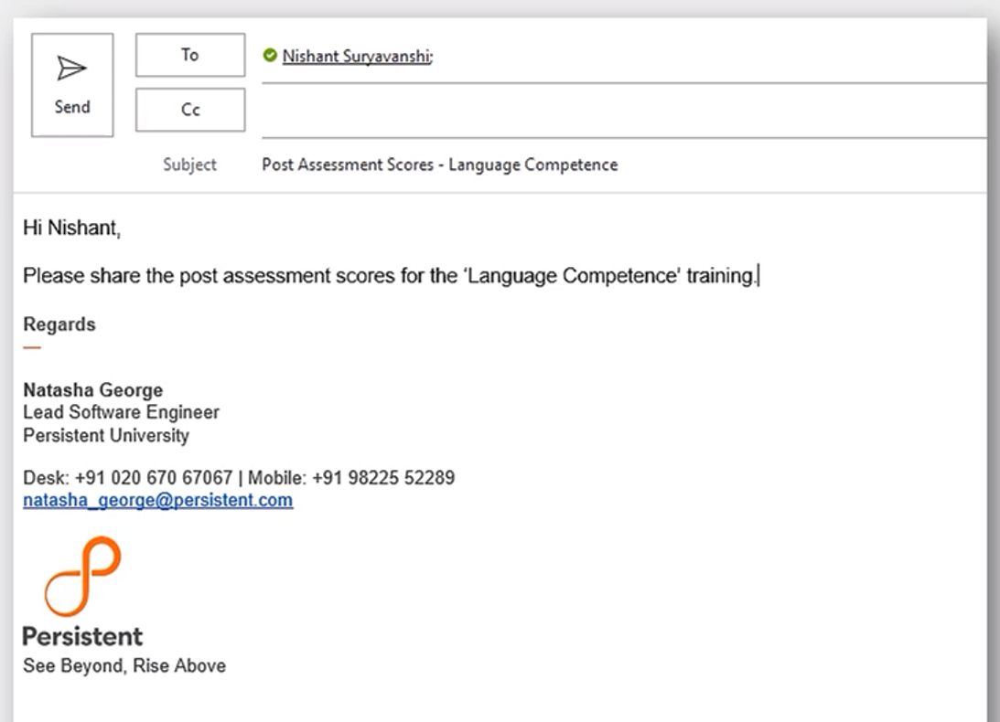

No Opening Line affects the :
- reader has no background about the topic
- reader might not be able to take action

To avoid this, your email should have:
- power line should briefly describe what the email is about
- *"This email is about.."* or *"This email is with reference to.."*

This is the correct version of opening line 👇
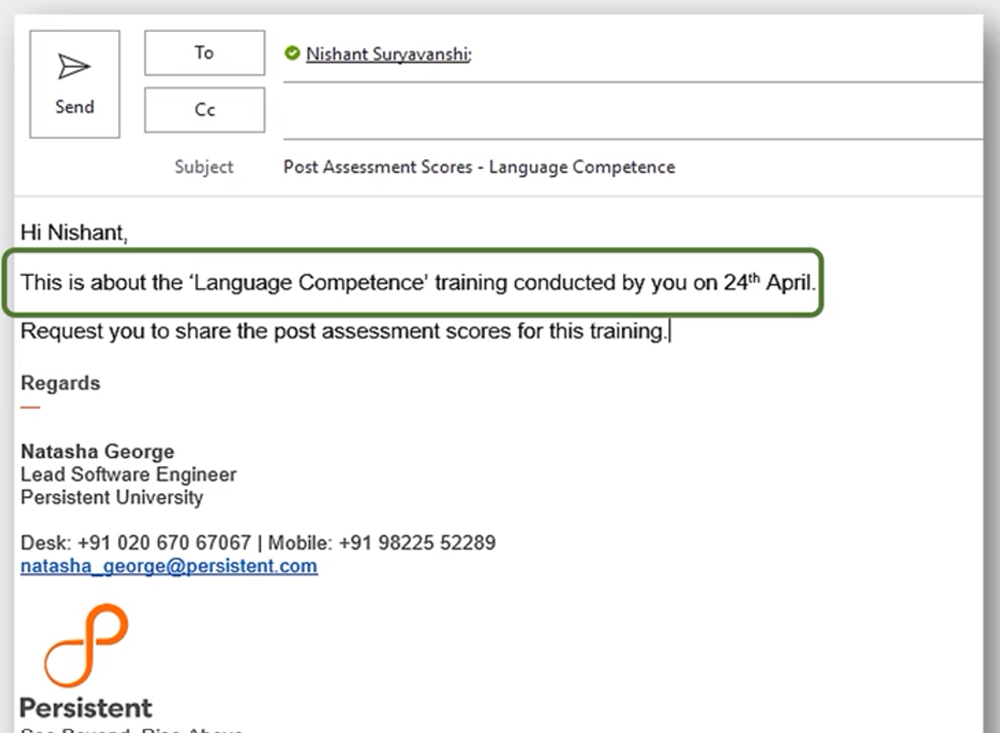

### Email Body
This is the incorrect version of email body 👇
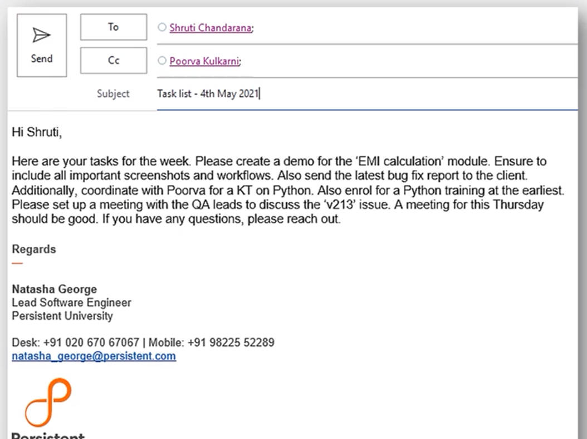

The body of the email should not be too wordy otherwise:
- it'll be verbose and unorganized emails become tedious to read
- take longer to read
- could make the reader lose interest and also lose information

This is the correct version of email body 👇
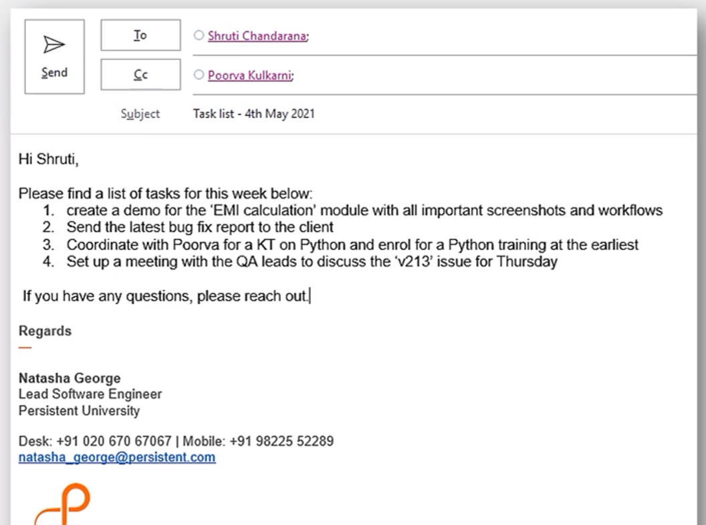

- arrange information sequentially in neat paragraphs
- information should start from the most important to least important
- make use of bullets if your email touches upon several points
- use diagrammatic representations if email becomes too lengthy

### Request Line
An email ends with a request line

This incorrect version of no request line 👇
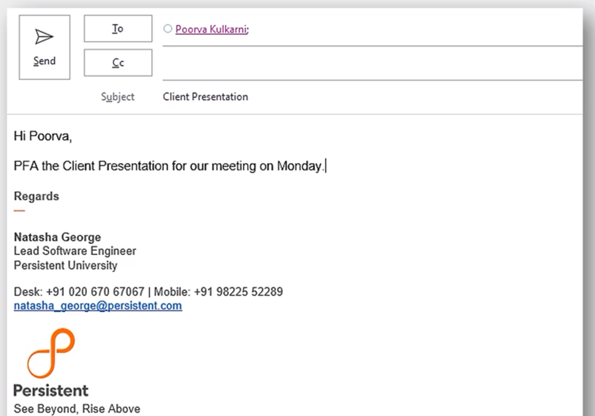

If the request line is absent then:
- reader will not know what action to take
- makes an email end abruptly

This is the correct version of request line:
- mention clear request at the end of the email
- mention urgency or priority in the ending line
- "Request you to approve my leave" OR "Please share the details"
- thank the reader

This is the correct version of no request line 👇
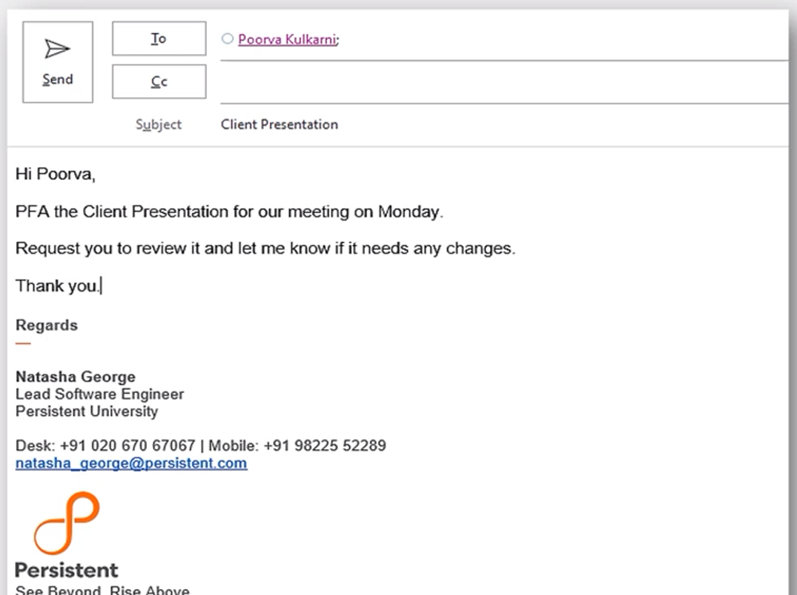

### Signature
This is the incorrect version of signature 👇

If their is no signature at the end:
- reader will not know your identity
- reader will not have your contact details to get in touch

Remember:
- mention all details
- ensure that the signature is brand compliant
- keep the signature simple

This is the correct version of signature 👇
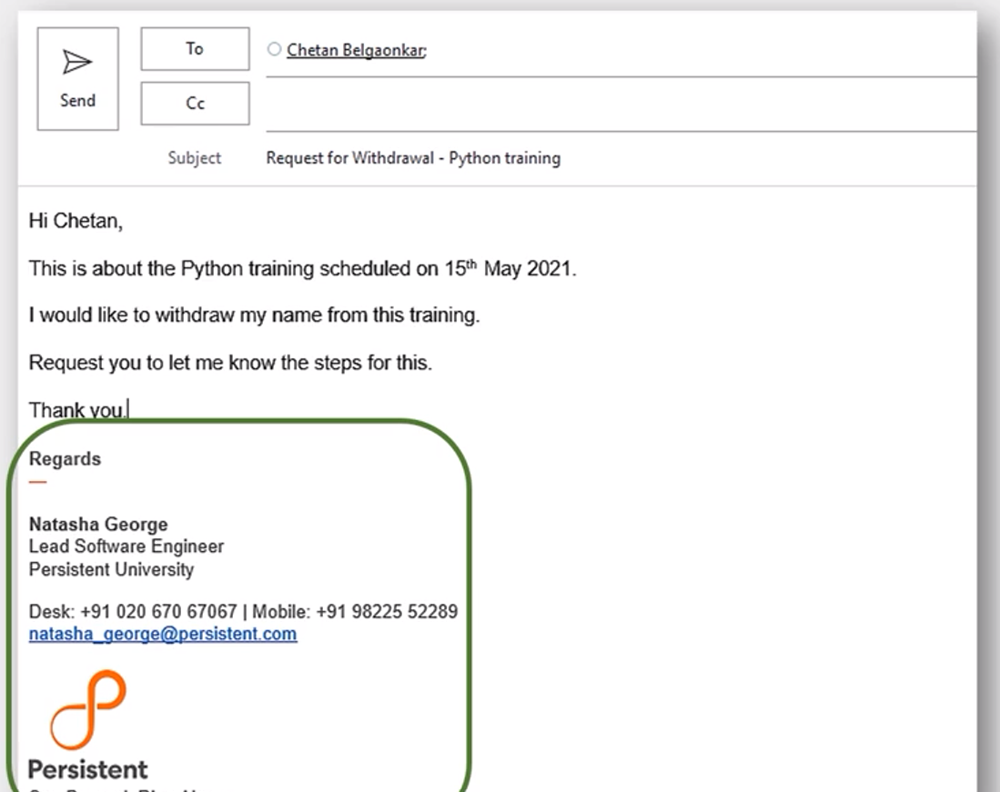

### 4. Formatting the Email
An email that looks good is more readable and is easily understood. There are various formatting aspects and tools to add to your email's visual appeal

- **Font** :  
    While writing your emails, make sure to use Persistent's brand-compliant font - Arial.  
    A font size of 10 or 11 is the most appropriate.  
    Stick to black or navy blue font colors as they look the most professional.

- **Writing style** : 
    Always use Sentence Case while writing.  
    using all lowercase makes you look unprofessional.  
    USING ALL UPPERCASE SEEMS LIKE YOU'RE YELLING.  

- **Alignment** : 
    Keep all your text left-aligned to ensure maximum readability.  
    Center aligned or left-aligned text looks sloppy.

- **Background** : 
    Keep the email background plain white as that's the most professional.

- **Highlighting** : 
    You may use color highlighting to emphasize certain points in your email. You could also try using a different font color or bold text.

### Top Tips for Email Writing
1. Always write an email from the reader's perspective, thinking about how much they already know and what they would need to know.

2. Never write an email when you're angry or upset, it might reflect in your tone. Take a break, calm down and then write the email.

3. Set an 'Out of Office' automatic response when you're away for long or when you're on leave.

4. Avoid sending unnecessary attachments or sending an email to people who aren't involved in the discussion.

5. Reply to an email preferably within 24 hours. Use the 'Reply All' option only when all the recipients need to know the information you're sharing.

## Summary
1. Emails are the official means of business communication and are a quick way to send information to multiple people across locations.

2. Emails reflect our professionalism and also help us connect with our readers.

3. Effective emails are Clear, Concise, Concrete, Coherent, Correct, Courteous, and Complete.

4. The Guffeys's writing process involves 3 steps - Prewriting, Writing, and Revising.

5. An email has different parts and there is etiquette associated with each part.

6. Formatting is an important aspect of email etiquette that deals with the visual appeal of an email and make it more reader-friendly.

----------------------------------------------

# Lesson 2 | Writing Professional Emails

## Should I Send an Email?
Evaluate your message, audience, and objectives to determine if an email is the most appropriate form of communication. Business emails are ideal for documenting, organizing, and formalizing conversations. 

They also help disseminate information to a large audience quickly and cheaply. That’s why organizations use email to share product updates, company news, and other announcements. 

**Emails are a form of aynchronous communication** : Communication is delayed rather than instant. The recipient can open and respond to an email on their own time and terms.

## When Not To Send an Email
However, in some situations, a phone or video call, in-person conversation, or direct message may be more appropriate. 

Consider the following limitations of emails. Do any of these statements apply to you? If so, then you may want to choose another medium.

- **I need to send confidential customer, employee, or personal information.** Unencrypted emails are vulnerable to cyberattacks. Sharing credit card information, usernames and passwords, or other personal details may require additional precautions.

- **I need to discuss a private or sensitive subject.** Emails can feel impersonal, making them a mismatch for breaking bad news or having difficult conversations. Another risk: senders or receivers may accidentally leave an email open on their screen—or forward it to unintended persons. 

- **I expect a lot of back-and-forth discussion.** It takes more time and effort to write an email than to make a phone call, talk in person, or send a direct message. Lengthy or complex conversations can also become cumbersome and confusing over email.

- **I need an immediate response.** Similarly, don’t let urgent messages get buried in a receiver’s inbox. If you need a quick response, give the other person a call, swing by their office, or send an instant message.

Emails create a “digital” trail. Use them to organize and document information—such as sharing meeting notes with your team, assigning tasks, or submitting formal requests. Don’t share confidential information, deliver bad news, or discuss private matters over email.

## Anatomy of Business Email
Business emails follow a predictable format. Move through the markers below to dissect the anatomy of a typical business email. 

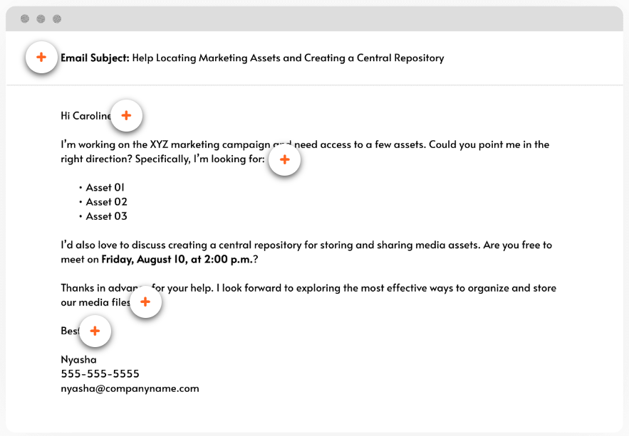

### Subject Line
A subject line summarizes an email. What can the recipient except?

Create subject lines that make it easy for recipients to organize, prioritize, and locate emails in their ebox. For example, write a subject line that's:

- **Concise.** : Don't try to fit your entire email into a subject line.
- **Obvious.** : Make it obvious what the email is about

### Greeting
Always begin your email with an appropriate greeting. Depending on your tone and relationship with the recipient, you might write:
- Hi [insert name]
- Dear [insert name]
- Good morning/afternoon
- Greetings

### Body
The body conveys the purpose of your email. You can structure your email body in one of two ways:
- **Direct.** Lead with your main decision, mesage, or request. Then support it with additional context or background information.
- **Indirect.** Start with background information, builiding up to your main decision, message or request at the end of your email.

### Closing
Add a closing sentence or paragraph before signing off. Summarize key takeaways, recap action items, or express gratitude or good wishes.

For example: *To recap, Jovanie will write the press release, Ben will contact our strategic partners, and Issa will manage our social media channels. I appreciate your support."*

### Sign-Off
End business emails with an appropriate sign-off and contact information. Depending on your tone and relationship with the recipient,  you might write:
- Sincerely
- Thanks/Thank you
- Best or Best wishes/Regards
- Kind wishes/regards
- See you soon/Speak soon
- Looking forward to hearing from you
- Have a great day/week/weekend

## 5 Key Traits of Professional Email
Emails differ from phone, in-person, or direct message conversations because you have the opportunity to plan and edit your message before sending. There’s no excuse for disorganized thoughts, typos, or other mistakes. Write more thoughtful and professional business emails by ensuring that they exhibit each of these five characteristics. 

- **Formality** :
    Don’t confuse business with personal emails. How you communicate in a casual email to a close friend won’t fly when emailing your boss, coworkers, or clients. 
    
    Keep business emails professional and formal by avoiding or limiting the use of:
    - Emoticons, slang, or colloquialisms 
    - Words spelled in all caps 
    - Unnecessary exclamation points, highlighting, bolding, or italics
    - Unconventional fonts or font colors 

    *Remember*: Emails create a potentially permanent conversation record. Always be polite, and never write an email when you’re angry or emotional—lest it come back to haunt you.

- **Polish** : Always edit and proofread your emails for spelling, grammar, or punctuation mistakes. Review content for broken links or inaccuracies. 

    And to avoid embarrassment, always double-check your recipient field so you don’t accidentally forward private information to the wrong person or group.

    *Tip*: Send a test email to yourself or a trusted coworker, especially before dispatching an email to a large recipient list or important stakeholder or customer.  

- **Clarity** : Is your message clear and easy to understand? Muddled emails can cause misunderstandings—or lead recipients to miss your point. 

    Keep emails organized and accessible with these tips: 
    - **Use simple and straightforward language.** Avoid jargon, acronyms, uncommon words, or overly formal language. 
    - **“Chunk” information**. Break information into bite-sized pieces by using short paragraphs and numbered or bulleted lists.
    - **Employ graphic highlighting**. Bolding, italics, or other graphic highlighting techniques draw attention to important information. 
    - **Create a logical structure of ideas**. Craft a message that’s coherent and easy to follow. Follow traditional email-formatting rules.

- **Concision** : Respect your recipient’s time by getting to the point. Be **concise** and avoid rambling run-on sentences or superfluous information. 

    Ask yourself, *“What’s my purpose for writing this email?”* Keep your message focused on that purpose. Use short sentences, and cut unnecessary words or details. 

- **Appropriateness** : Last style tip: Check your tone to make sure it’s appropriate for your work culture and audience. 

    For example:
    - **Formal tone**. Corporate environments (such as legal or finance) typically use a formal tone to display professionalism. Also, use a formal tone when communicating with people you don’t know well. 

    - **Informal tone**. Some work cultures (such as creative agencies or startups) employ a more casual tone in communications. Employees or customers of these organizations may perceive a formal email as stiff, cold, or impersonal—especially if you have a close relationship.

    *Remember*: Recipients can’t read your body language or hear your tone of voice over email. Avoid sarcasm or jokes that a recipient could misinterpret. Also, be intentional about your tone in writing to ensure that your message doesn’t come across as angry or annoyed.

## A Before-and-After Example
### Before
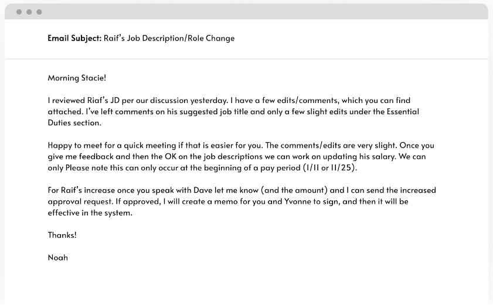

### After
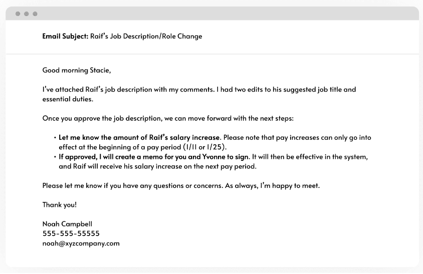

#### What changes did you notice?
The second example scrubbed the email of acronyms, typos, and spelling mistakes. It’s also clearer, concise, well-structured, and easy to follow. 

Bullet points and bolding draw the eye to key action items, and a new signature lets Stacie know where to reach Noah. 

Send a copy to yourself. Send a copy of important emails to yourself to file for future reference.

Every professional email has a purpose. Common pitfalls like wordiness, typos, and informal language keep you from achieving your objectives. By following these tips, you can communicate more effectively and build a positive work reputation.

-------------------------------------------------

# Assess

1. Which of these are steps included in 'revise' phase of Guffey's 3x3 process? --> *Revise, Proofread, Evaluate*

2. How many words is a good length subject line? --> *3-5 words*

3. Which of these words should be avoided in the subject line? --> *Regarding, About, For*

4. Which of these are goof practices while writing emails? --> *Never write an email when you're angry or upset, Set an 'Out of Office' automatic response when you're on leave, Use the 'Reply All' only when all the recipients need to know the information you're sharing*

5. Which of these sentences is inaccurate about email communication ? --> *All of these*

6. Which of theses steps included in 'pre-writing' phase of Guffey's 3x3 process? --> *Analyze, Anticipate, Adapt*

7. Which of these are steps included in 'writing' phase of Guffey's 3x3 process? --> *Research, Organize, Compose*

8. Email etiquette refers to:
    - The principles of behaviour that one should use when writing or responding to emails
    - The code of conduct for email communication
9. You should respond to an email when you are mentioned in the **to** field of the email. 
10. Revising is about identifying and correcting: --> **Spelling erros, Grammar errors, Information errors**
11. The people who need to take action on your email or need the information are marked in **to** field.
12. Which of these is not a reason to follow email etiquette? --> To always get your way with the people around